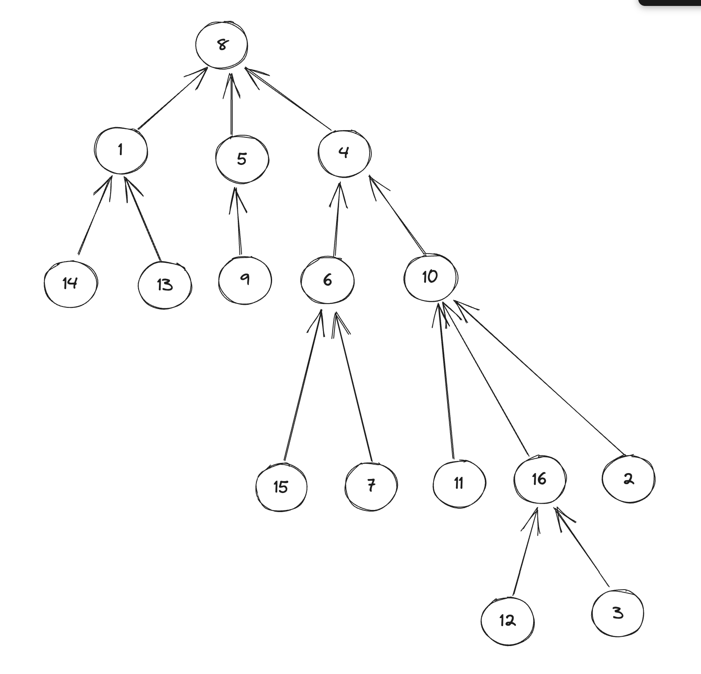

트리에서 가장 가까운 공통조상을 구해보자

## [백준] 3584 가장 가까운 공통 조상

### 문제

루트가 있는 트리(rooted tree)가 주어지고, 그 트리 상의 두 정점이 주어질 때 그들의 가장 가까운 공통 조상(Nearest Common Anscestor)은 다음과 같이 정의됩니다.

두 노드의 가장 가까운 공통 조상은, 두 노드를 모두 자손으로 가지면서 깊이가 가장 깊은(즉 두 노드에 가장 가까운) 노드를 말합니다.
nca.png

예를 들어 15와 11를 모두 자손으로 갖는 노드는 4와 8이 있지만, 그 중 깊이가 가장 깊은(15와 11에 가장 가까운) 노드는 4 이므로 가장 가까운 공통 조상은 4가 됩니다.

루트가 있는 트리가 주어지고, 두 노드가 주어질 때 그 두 노드의 가장 가까운 공통 조상을 찾는 프로그램을 작성하세요

### 입력

첫 줄에 테스트 케이스의 개수 T가 주어집니다.

각 테스트 케이스마다, 첫째 줄에 트리를 구성하는 노드의 수 N이 주어집니다. (2 ≤ N ≤ 10,000)

그리고 그 다음 N-1개의 줄에 트리를 구성하는 간선 정보가 주어집니다. 한 간선 당 한 줄에 두 개의 숫자 A B 가 순서대로 주어지는데, 이는 A가 B의 부모라는 뜻입니다. (당연히 정점이 N개인 트리는 항상 N-1개의 간선으로 이루어집니다!) A와 B는 1 이상 N 이하의 정수로 이름 붙여집니다.

테스트 케이스의 마지막 줄에 가장 가까운 공통 조상을 구할 두 노드가 주어집니다.

### 출력

각 테스트 케이스 별로, 첫 줄에 입력에서 주어진 두 노드의 가장 가까운 공통 조상을 출력합니다.

### 예제 입력 & 출력

| 예제 입력                                                                                                                                                                    | 예제 출력 |
| :--------------------------------------------------------------------------------------------------------------------------------------------------------------------------- | :-------- |
| 2<br>16<br>1 14<br>8 5<br>10 16<br>5 9<br>4 6<br>8 4<br>4 10<br>1 13<br>6 15<br>10 11<br>6 7<br>10 2<br>16 3<br>8 1<br>16 12<br>16 7<br>5<br>2 3<br>3 4<br>3 1<br>1 5<br>3 5 | 4<br>3    |

### 풀이

이 문제는 두개의 노드의 부모들중에 가장 먼저 겹치게 되는 부모 노드를 구하면 풀 수 있는 문제였다. 그래서 주어진 예시를 예로 들었을 때

|                                 예제 1번                                 |
| :----------------------------------------------------------------------: |
|  |

현재 상태에서 16노드와 7노드의 가장 가까운 공통 조상을 찾기 위해 16노드의 부모들을 지나가면서 visited 배열에 표시한다.(본인 포함) 그림상으로는 16, 10, 4, 8순서

이후 7노드의 부모들을 순서대로 찾아가면서 이미 표시된(즉 16노드의 부모인) 노드를 찾았을 경우 그 노드를 리턴한다. 그림상으로는 7, 6, 4, 8순이지만 4가 공통 조상이므로 4까지만 반복후 4 리턴..

### 코드

```java
import java.util.*;

public class Main {
  static int solution(int[] node, int x, int y){
    boolean[] visited = new boolean[10001];
    //첫번째 노드의 부모 노드 찾아서 visit표시
    while(true){
      if(x == 0)
        break;
      visited[x] = true;
      x = node[x];
    }
    //두번쨰 노드의 부모 노드 찾는중 공통 조상일 경우 그 노드 리턴!
    while(true){
      if(visited[y])
        return y;
      y = node[y];
    }
  }
  public static void main(String[] args) {
    Scanner sc = new Scanner(System.in);
    //입력받기
    int t = sc.nextInt();
    for(int i = 0; i < t; i++){
      int n = sc.nextInt();
      int[] node = new int[10001];
      for(int j = 0; j < n - 1; j++){
        int parent = sc.nextInt();
        int child = sc.nextInt();
        //node 부모 자식 저장
        node[child] = parent;
      }
      int x = sc.nextInt();
      int y = sc.nextInt();
      //결과 출력
      System.out.println(solution(node, x, y));
    }
    sc.close();
  }
}


```

### 참고자료

[_백준 1311번 할 일 정하기 풀러가기_](https://www.acmicpc.net/problem/3584)
