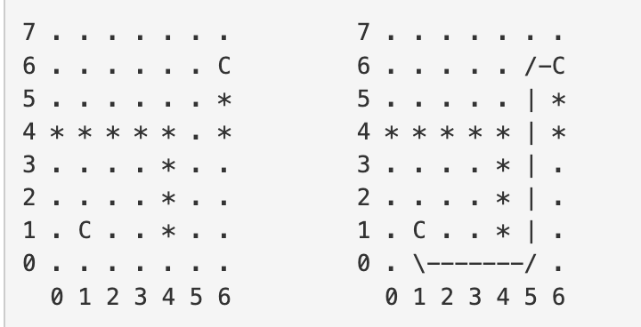
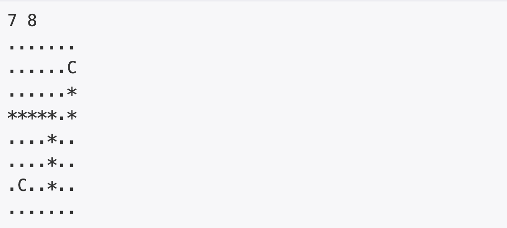

bfs와 메모제이션을 사용해서 레이저 통신 문제를 풀어보자

## [백준] 6087 레이저 통신

### 문제

크기가 1×1인 정사각형으로 나누어진 W×H 크기의 지도가 있다. 지도의 각 칸은 빈 칸이거나 벽이며, 두 칸은 'C'로 표시되어 있는 칸이다.

'C'로 표시되어 있는 두 칸을 레이저로 통신하기 위해서 설치해야 하는 거울 개수의 최솟값을 구하는 프로그램을 작성하시오. 레이저로 통신한다는 것은 두 칸을 레이저로 연결할 수 있음을 의미한다.

레이저는 C에서만 발사할 수 있고, 빈 칸에 거울('/', '\')을 설치해서 방향을 90도 회전시킬 수 있다.

아래 그림은 H = 8, W = 7인 경우이고, 빈 칸은 '.', 벽은 '\*'로 나타냈다. 왼쪽은 초기 상태, 오른쪽은 최소 개수의 거울을 사용해서 두 'C'를 연결한 것이다.

|                                   예제                                   |
| :----------------------------------------------------------------------: |
|  |

### 입력

첫째 줄에 W와 H가 주어진다. (1 ≤ W, H ≤ 100)

둘째 줄부터 H개의 줄에 지도가 주어진다. 지도의 각 문자가 의미하는 것은 다음과 같다.

.: 빈 칸

\*: 벽

C: 레이저로 연결해야 하는 칸

'C'는 항상 두 개이고, 레이저로 연결할 수 있는 입력만 주어진다.

### 출력

첫째 줄에 C를 연결하기 위해 설치해야 하는 거울 개수의 최솟값을 출력한다.

### 예제 입력 & 출력

| 예제 입력                                                                     | 예제 출력 |
| :---------------------------------------------------------------------------- | :-------- |
|  | 3         |

### 풀이

이문제의 경우 dfs와 메모제이션을 사용해야 하는 문제였다.

일단 Point 클래스를 살펴보면 x, y 좌표와 이 점에 도착전에 움직인 방향의 인덱스를 표시하는 prevPathIndex와 이점에 도달하기 까지 사용된 거울의 개수를 표시하는 cnt가 맴버로 존재한다. 그리고 move메서드를 활용해 움직이는 방향을 받았을때 다음 점의 x, y좌표를 가지고 있는 Point객체를 반환한다.

다음으로 솔루션 메서드를 확인하면, `여느 bfs와 같이 queue가 존재하는데 visited가 3차원으로 생성되어있다.` 그이유는 해당 점에 도착하기까지 오는 방향에 따라 이후 사용되는 거울의 수가 바뀔 수 있기 때문에 이점에 도달할때 오는 방향에 따른 거울의 수를 모두 저장해주어야 한다.

이후 while문을 살펴보면

cur point와 도착점을 비교해서 도착점에 해당된다면 cur point에 4가지 방향에서 들어온 방법중에 최솟값을 answer 에 저장한다.

cur point가 도착점이 아니라면 4가지 방향으로 움직이는데 이 움직이는 point를 next라 할때

next가 map을 벗어나면 그 점은 제외한다.

next가 온방향과 다른 방향으로 움직인 경우 거울을 사용한 경우 이므로 next.cnt를 cut.cnt + 1로 갱신해준다.

이후 visited[next.x][next.y][i] 온방향에 해당하는 visited가 갱신되어있으면서 next.cut 보다 작거나 같으면 이미 방문했으므로 continue, 더 크다면 next.cnt로 visited를 갱신해주고 queue에 next Point를 넣는다.

### 코드

```java
import java.util.*;

public class Main {

  //point 객체
  public static class Point {
    //x, y 좌표, prePathIndex: 이 점에 도달하기 위해 움직인 방향, cnt: 이 점에 도달하기 까지 사용된 거울의수
    int x;
    int y;
    int prevPathIndex;
    int cnt;
    public Point(int x, int y){
      this.x = x;
      this.y = y;
      this.prevPathIndex = -1;
      this.cnt = 0;
    }
    // Point 객체 움직임 메서드
    public Point move(int i){
      int moveX[] = {-1, 0, 1, 0};
      int moveY[] = {0, 1, 0, -1};
      int x = this.x + moveX[i];
      int y = this.y + moveY[i];
      return new Point(x, y);
    }
  };

  static int solution(int h, int w, char[][] map, Point stPoint, Point endPoint){
    int answer = Integer.MAX_VALUE;
    Queue<Point> q = new LinkedList<>();

    // 각 점에 도달하는 방향에 따른 최솟값을 저장하기 위한 배열
    int[][][] visited = new int[101][101][4];

    // 배열 Integer 최댓값으로 초기화
    for(int i = 0; i < 101; i++){
      for(int j = 0; j < 101; j++)
        for(int k = 0; k < 4; k++)
          visited[i][j][k] = Integer.MAX_VALUE;
    }

    // 시작점 queue에 대입
    q.add(stPoint);

    // 모든 방향에 대한 시작점 visited 1로 초기화
    for(int i = 0; i < 4; i++)
      visited[stPoint.x][stPoint.y][i] = 1;

    while(!q.isEmpty()){
      // 현재 위치 cur
      Point cur = q.poll();

      // cur 와 도착점이 같은 경우 visited에서 최솟값 가져오기
      if(cur.x == endPoint.x && cur.y == endPoint.y){
        for(int i = 0; i < 4; i++)
          answer = Math.min(answer, visited[cur.x][cur.y][i]);
        continue;
      }

      // cur에서 4가지 방향으로 움직여보기
      for(int i = 0; i < 4; i++){
        Point next = cur.move(i);

        // map을 벗어나는 경우 continue;
        if(next.x < 0 || next.x >= h || next.y < 0 || next.y >= w || map[next.x][next.y] == '*')
        continue;

        // map을 벗어나지 않는 경우 왔던 방향과 다를 때 cur.cnt + 1을 next.cnt에 저장
        next.cnt = (cur.prevPathIndex != i && cur.prevPathIndex != -1 )? cur.cnt + 1 : cur.cnt;

        // next에 도달한 방향으로 이전에 방문한 경우가 거울 수가 적으면 continue;
        if(visited[next.x][next.y][i] <= next.cnt)
          continue;

        // 아닌경우 visited 갱신, next 객체 queue에 넣기
        next.prevPathIndex = i;
        visited[next.x][next.y][i] = next.cnt;
        q.add(next);
      }
    }
    return answer;
  }
  public static void main(String[] args) {
    Scanner sc = new Scanner(System.in);
    char[][] map = new char[101][101];
    // 입력 받기
    int w = sc.nextInt();
    int h = sc.nextInt();
    sc.nextLine();
    Point stPoint = new Point(-1, -1);
    Point endPoint = new Point(-1, -1);
    int cnt = 0;
    for(int i = 0; i < h; i++){
      String tmp = sc.nextLine();
      for(int j = 0; j < w; j++){
        map[i][j] = tmp.charAt(j);
        if(map[i][j] == 'C'){
          if(cnt == 0){
            stPoint = new Point(i, j);
            cnt++;
          }
          else{
            endPoint = new Point(i, j);
          }
        }
      }
    }
    sc.close();
    int ans = solution(h, w, map, stPoint, endPoint);
    System.out.println(ans);
  }
}


```

### 참고자료

[_백준 레이저 통신 풀러가기_](https://www.acmicpc.net/problem/6087)
