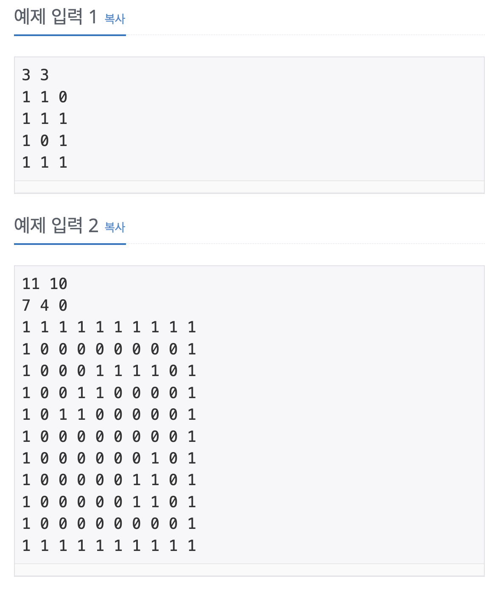
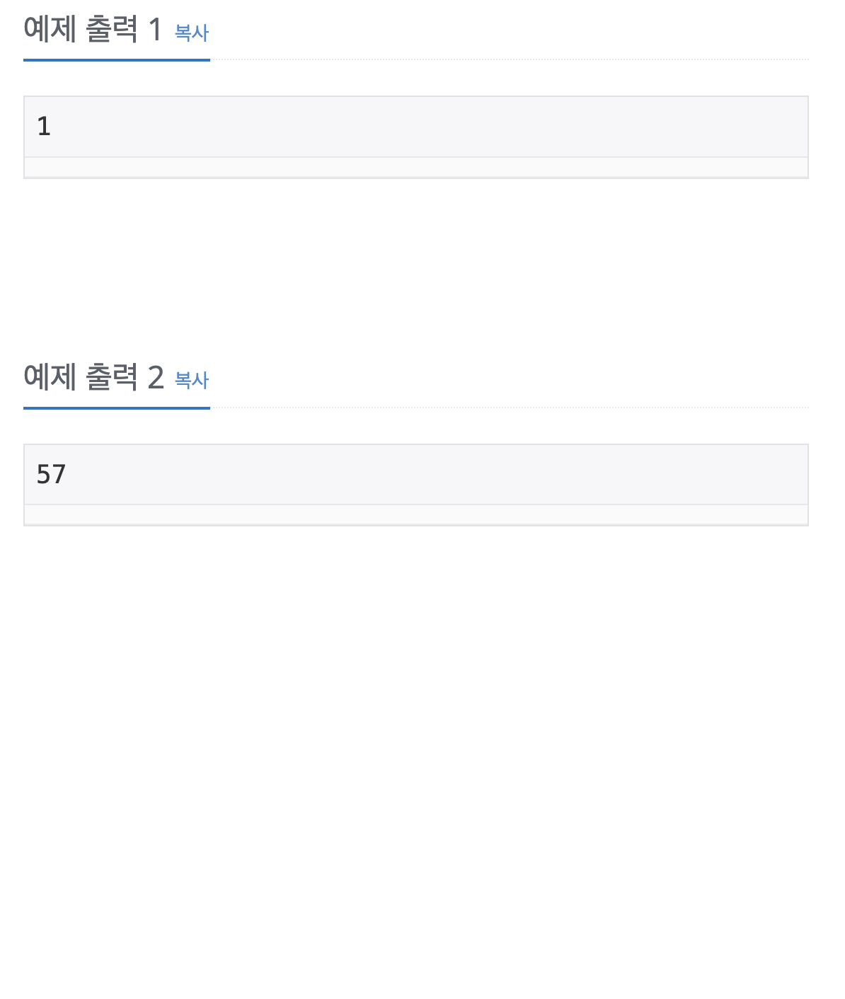

dfs와 사용해서 로봇 청소기 문제를 풀어보자

## [백준] 14503 로봇 청소기

### 문제

로봇 청소기와 방의 상태가 주어졌을 때, 청소하는 영역의 개수를 구하는 프로그램을 작성하시오.

로봇 청소기가 있는 방은
$N \times M$ 크기의 직사각형으로 나타낼 수 있으며, $1 \times 1$ 크기의 정사각형 칸으로 나누어져 있다.

각각의 칸은 벽 또는 빈 칸이다. 청소기는 바라보는 방향이 있으며, 이 방향은 동, 서, 남, 북 중 하나이다.

방의 각 칸은 좌표 $(r, c)$ 로 나타낼 수 있고, 가장 북쪽 줄의 가장 서쪽 칸의 좌표가 $(0, 0)$, 가장 남쪽 줄의 가장 동쪽 칸의 좌표가 $(N-1, M-1)$ 이다.

즉, 좌표 $(r, c)$는 북쪽에서 $(r+1)$ 번째에 있는 줄의 서쪽에서 $(c+1)$ 번째 칸을 가리킨다. 처음에 빈 칸은 전부 청소되지 않은 상태이다.

로봇 청소기는 다음과 같이 작동한다.

현재 칸이 아직 청소되지 않은 경우, 현재 칸을 청소한다.

현재 칸의 주변 $4$ 칸 중 청소되지 않은 빈 칸이 없는 경우, 바라보는 방향을 유지한 채로 한 칸 후진할 수 있다면 한 칸 후진하고 1번으로 돌아간다.

바라보는 방향의 뒤쪽 칸이 벽이라 후진할 수 없다면 작동을 멈춘다.

현재 칸의 주변 $4$ 칸 중 청소되지 않은 빈 칸이 있는 경우, 반시계 방향으로 $90^\circ$ 회전한다.

바라보는 방향을 기준으로 앞쪽 칸이 청소되지 않은 빈 칸인 경우 한 칸 전진한다.

1번으로 돌아간다.

### 입력

첫째 줄에 방의 크기 $N$ 과 $M$ 이 입력된다.

$(3 \le N, M \le 50)$  둘째 줄에 처음에 로봇 청소기가 있는 칸의 좌표 $(r, c)$ 와 처음에 로봇 청소기가 바라보는 방향 $d$ 가 입력된다.

$d$ 가 $0$ 인 경우 북쪽,
$1$인 경우 동쪽,
$2$인 경우 남쪽,
$3$인 경우 서쪽을 바라보고 있는 것이다.

셋째 줄부터 $N$ 개의 줄에 각 장소의 상태를 나타내는 $N \times M$ 개의 값이 한 줄에 $M$ 개씩 입력된다.

$i$번째 줄의 $j$ 번째 값은 칸 $(i, j)$ 의 상태를 나타내며, 이 값이 $0$ 인 경우 $(i, j)$ 가 청소되지 않은 빈 칸이고, $1$ 인 경우 $(i, j)$에 벽이 있는 것이다.

방의 가장 북쪽, 가장 남쪽, 가장 서쪽, 가장 동쪽 줄 중 하나 이상에 위치한 모든 칸에는 벽이 있다. 로봇 청소기가 있는 칸은 항상 빈 칸이다.

### 출력

로봇 청소기가 작동을 시작한 후 작동을 멈출 때까지 청소하는 칸의 개수를 출력한다.

### 예제 입력 & 출력

| 예제 입력                                                                    | 예제 출력                                                                     |
| :--------------------------------------------------------------------------- | :---------------------------------------------------------------------------- |
|  |  |

### 풀이

이문제는 dfs dfs모두 풀이가 가능한 문제였다. 이 문제는 여러가지의 함정이 존재하는 만큼 지문을 꼼꼼히 읽어보아야 하는 필요성이 있었다.

> 주어지는 방향이 동쪽이 1, 서쪽이 3이다.

우리가 반복문을 돌릴때 반시계 방향이다 보니 북, 서, 남, 동 순으로 배열을 만들게 되는데 이때 동쪽과 서쪽은 반대의 index를 가지게 되어서 입력받은 d를 변환해줘야 한다.

> 로봇청소기는 해당 칸을 청소한 후에는 무조건 90도를 회전한다.

그래서 우리가 dfs로 받은 이전의 방향에서 1을 추가한 index의 방향을 첫번째로 고려해야한다.

> 청소할 곳이 없을 때 뒤로가는 움직임은 여러번 진행될 수 있다.

그래서 청소기가 뒤로 가면서 벽이 있지 않으면 계속 뒤로 움직일 수 있다.

이러한 헷갈리는 부분을 제외하면 dfs와 dfs를 활용해서 풀 수 있다. 자세한 코드 설명은 주석을 확인!!

### 코드

```java
import java.util.*;
public class Main {
  // x, y 좌표로 이루어진 Point 객체
  static class Point{
    int x;
    int y;
    int direction;
    public Point(int x, int y, int d){
      this.x = x;
      this.y = y;
      this.direction = d;
    }
  }
  // 주어진 N, M, Map을 전역으로 처리 dfs를 위해
  static int N;
  static int M;
  static int[][] Map = new int[51][51];
  //주어진 로봇청소기의 움직임을 추적하는 dfs
  static int dfs(Point st){
    //도착점 청소
    Map[st.x][st.y] = 2;
    // 순서대로 북, 서, 남, 동 순서
    int[] nextX = {-1, 0, 1, 0};
    int[] nextY = {0, -1, 0, 1};
    // 청소후 90도를 돌고 시작하므로 1부터 시작 5에서 끝
    for(int i = 1; i < 5; i++){
      // 다음으로 움직이는 방향을 구하기
      int nextDirection = (st.direction + i) % 4;
      // 다음 포인트 객체 생성
      Point next = new Point(st.x + nextX[nextDirection] , st.y + nextY[nextDirection], nextDirection);
      // 맵을 벗어나는 경우
      if(next.x < 0 || next.x >= N || next.y < 0 || next.y >= M)
        continue;
      // 다음 포인트가 청소 되어있거나 벽인 경우
      if(Map[next.x][next.y] != 0)
        continue;
      // 다음 포인트로 이동
      return dfs(next) + 1;
    }
    // 사방향이 모두 청소된경우 뒤로 간 객체 back 생성
    Point back = new Point(st.x - nextX[st.direction], st.y - nextY[st.direction], st.direction);
    // 뒤로 갔을 떄 맵을 벗어나거나 벽인 경우
    if(back.x < 0 || back.x >= N || back.y < 0 || back.y >= M || Map[back.x][back.y] == 1)
      return 1;
    else
      return dfs(back);
  }
  static int solution(int r, int c, int d){
    // 시작점이 벽인 경우 제외
    if(Map[r][c] != 0)
      return 0;
    // 주어지는 동, 서 방향 전환하기
    if(d == 3)
      d = 1;
    else if(d == 1)
      d = 3;
    Point st = new Point(r, c, d);
    return dfs(st);
  }
  public static void main(String[] args) {
    Scanner sc = new Scanner(System.in);
    N = sc.nextInt();
    M = sc.nextInt();
    int r = sc.nextInt();
    int c = sc.nextInt();
    int d = sc.nextInt();
    for(int i = 0; i < N; i++){
      for(int j = 0; j < M; j++){
        Map[i][j] = sc.nextInt();
      }
    }
    sc.close();
    System.out.println(solution(r, c, d));
  }
}
```

### 참고자료

[_백준 로봇 청소기 풀러가기_](https://www.acmicpc.net/problem/14503)
