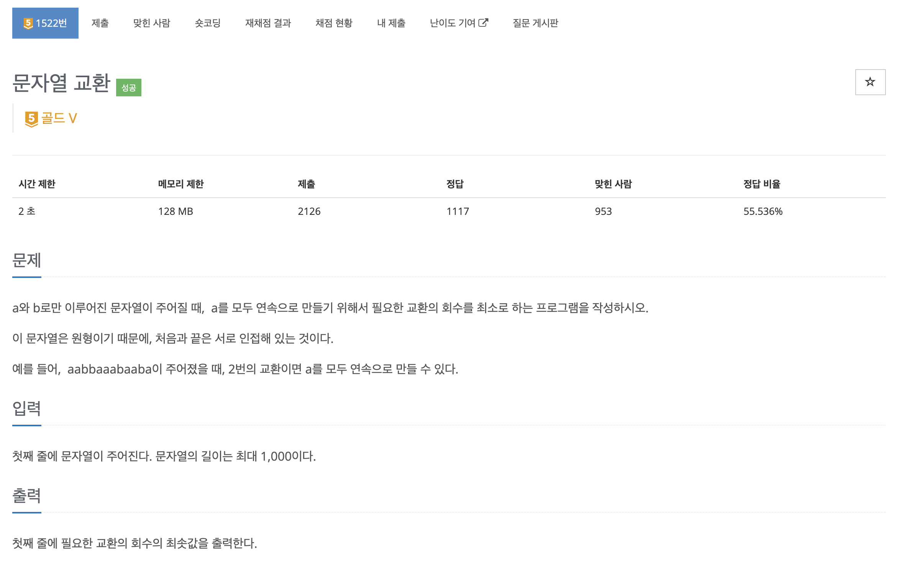
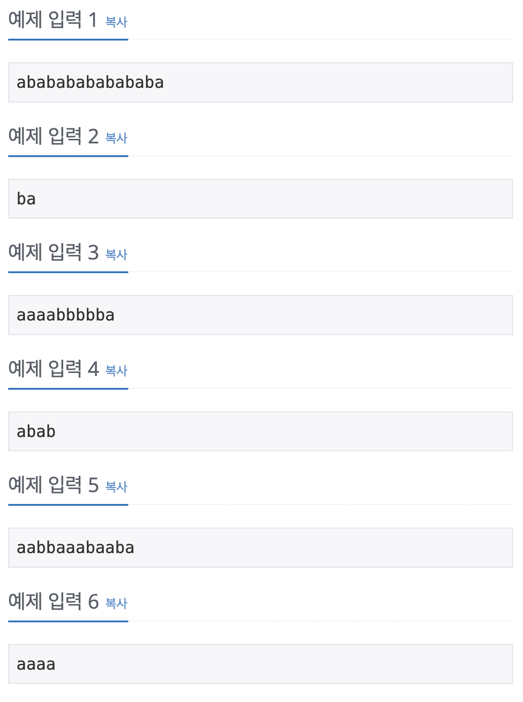
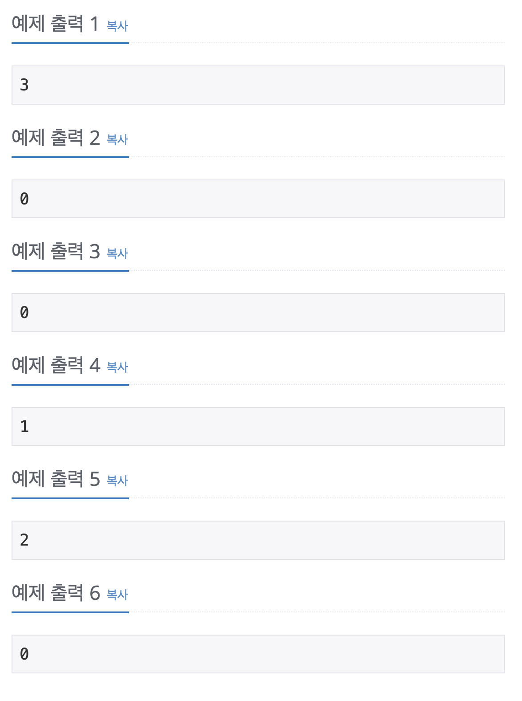

dfs와 사용해서 문자열 교환 문제를 풀어보자

## [백준] 1522 문자열 교환

### 문제

### 예제 입력 & 출력

| 예제 입력                                                                   | 예제 출력                                                                    |
| :-------------------------------------------------------------------------- | :--------------------------------------------------------------------------- |
|  |  |

### 풀이

이 문제는 슬라이딩 윈도우를 활용하는 문제였다. 전체 문자열에서 부분적으로 이어지는 부분으로 나누어서 생각하는 방법이다. 슬라이딩 윈도우는 투포인터와 비슷하지만 배열의 길이가 고정되어있다는 점이 다르다. 그러한 부분이 이 문제에서 활용하기 좋았다.

우리가 구하고자 하는 것은 'a'가 모두 이어지는 배열이므로 'a'의 개수만큼의 길이를 가지는 연속된 배열에서 'b'가 얼마나 들어잇는지만 확인하면 풀 수 있는 문제였다. 그러나 고려해야 할 점은 어디서 시작하는지에 따라 값이 변경되므로 문자열을 모두 돌면서 최솟값을 구하면 되는 문제였다.

이때 문제에서 주어진 문자열은 원형이라고 했기 때문에 문자열의 길이로 나머지 연산을 통해 연속적인 문자열을 확인하는 것이 주요했다.

### 코드

### 참고자료

[_백준 문자열 교환 풀러가기_](https://www.acmicpc.net/problem/1522)
