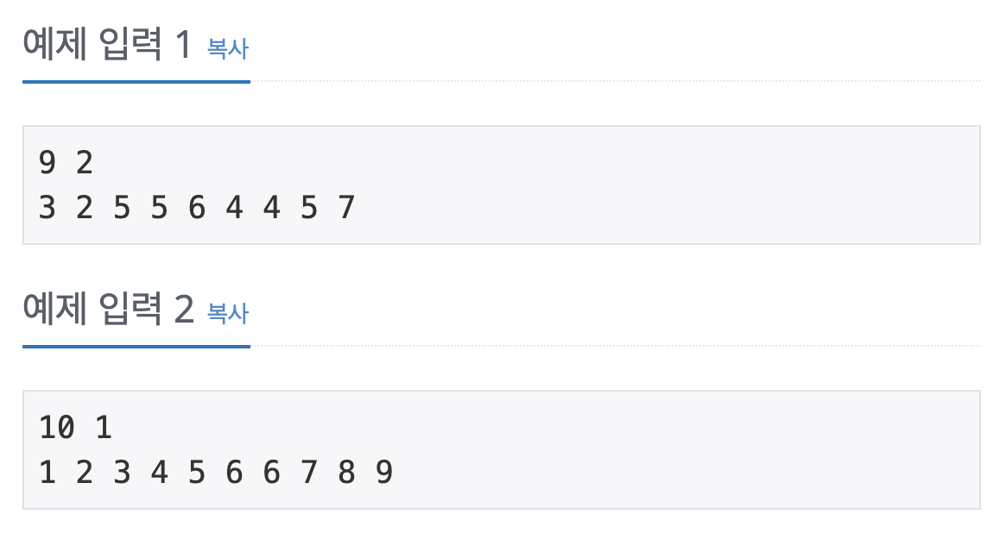
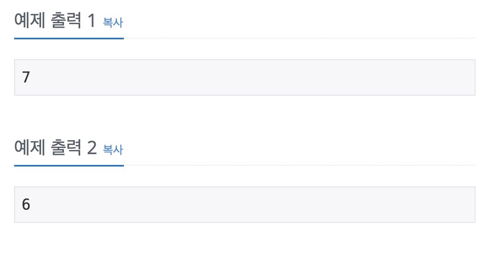

투포인터를 사용해서 겹치는 건 싫어 문제를 풀어보자

## [백준] 20922 겹치는 건 싫어

### 문제

### 예제 입력 & 출력

| 예제 입력                                                                      | 예제 출력                                                                       |
| :----------------------------------------------------------------------------- | :------------------------------------------------------------------------------ |
|  |  |

### 풀이

이 문제는 투포인터를 활용해서 수열을 만드는 문제였다.

단지 수열에 존재하는 숫자의 개수를 배열 또는 HashMap을 활용해서 count 할 수 있는데 아래의 코드는 HashMap을 활용하였다.

그리고 시간제한이 1초라서 Scanner 보다 BufferReader를 활용해야 정답을 얻을 수 있다.

### 코드

### 참고자료

[_백준 겹치는 건 싫어 풀러가기_](https://www.acmicpc.net/problem/20922)
