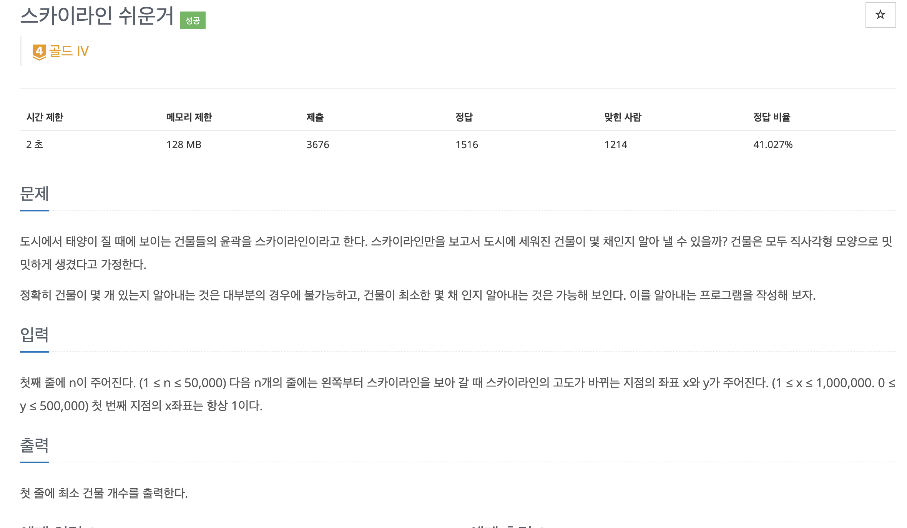
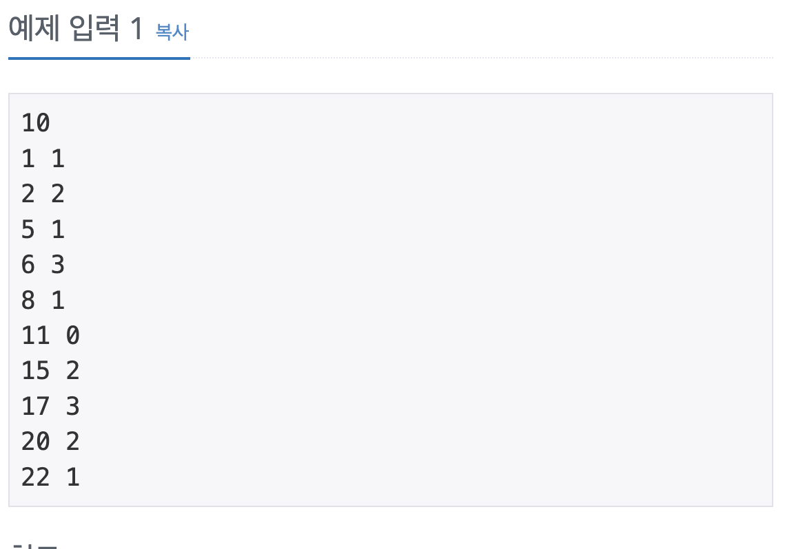
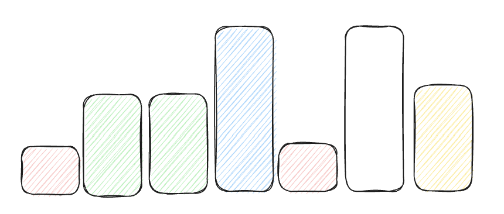

stack을 이용해서 스카이라인 쉬운거 문제를 풀어보자

## [백준] 1863 스카이라인 쉬운거

### 문제



### 예제 입력 & 출력

| 예제 입력                                                                   | 예제 출력                                                                    |
| :-------------------------------------------------------------------------- | :--------------------------------------------------------------------------- |
|  |  |

### 풀이

이 문제는 몇가지 예외를 주의하고 풀이하면 어렵지 않게 풀 수 있는 문제였다.
먼저 이문제는 반복문을 돌면서 이전에 빌딩들을 확인할 때 가까운 위치에 있는 빌딩들을 먼저 고려하는 것이 주요했다. 그렇기 때문에 queue가 아닌 stack을 사용하는게 더욱 좋은 방법이였다.

```java
  // stack에서 가장 나중에 들어간 값 return & 삭제
  stack.pop();
  // stack에서 가장 나중에 들어간 값 return
  stack.peek();
```

위와 같은 stack의 메서드를 활용하면 이전에 존재하는 빌딩들을 하나씩 확인할 수 있다.

스택을 활옹해서 이전에 빌딩 중에 현재 빌딩보다 높은 빌딩들은 끊기게 되기 때문에 반복문을 돌면서 현재의 빌딩이 이전보다 낮아지는 경우에는 이전 빌딩들을 저장한 stack에서 현재 빌딩보다 높은 빌딩들을 현재 빌딩과 같거나 작아지는 빌딩이 나오기 전까지 찾는 방법을 구현 할 수 있었다.

주어진 입력 & 출력을 제외하고 풀이에 도움이 되는 예시는

```text
  //입력
  5
  1 1
  2 2
  4 3
  5 1
  6 3
  7 2
  // 결과
  5
```



그림에서 같은 색의 빌딩이 같은 빌딩이라고 생각하면 이해하기 쉬울 것이다.

### 코드

<script src="https://emgithub.com/embed-v2.js?target=https%3A%2F%2Fgithub.com%2Fkoreaygj%2FAlgorithm_study%2Fblob%2Fmain%2FJava%2Fbaekjoon%2Fgold%2FBOJ1863%2FMain.java&style=androidstudio&type=code&showBorder=on&showLineNumbers=on&showFileMeta=on&showFullPath=on&showCopy=on"></script>

### 참고자료

[_백준 스카이라인 쉬운거 풀러가기_](https://www.acmicpc.net/problem/1863)
