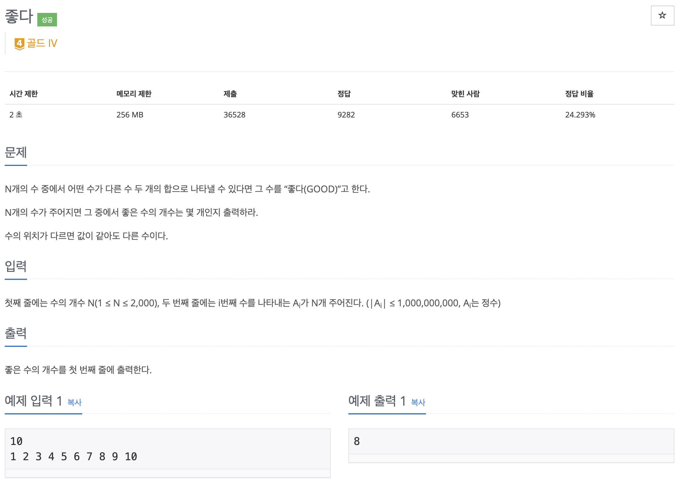

stack을 이용해서 좋다 문제를 풀어보자

## [백준] 1253 좋다

### 문제

### 풀이

문제에서 좋은 수의 조건에 맞는 수의 개수를 찾는 방식이기 때문에 수의 개수가 2000이기 때문에 수를 하나씩 대조해보는 방식을 떠올렸다. 그리고 주어지는 수는 `절댓값이 1,000,000,000이므로 음수와 양수` 모두를 고려해야 했다.

1. 일단 수를 모든 경우를 찾는 것보다는 이분탐색을 통해 찾는 것이 좀 더 빠른 방식이라고 생각했다. 그래서 주어진 배열을 오름차 순으로 일단 정렬을 했다.
2. 양수만 존재하는 경우에는 현재 인덱스 이전까지의 범위로 하겠지만 음수가 있어서 처음 범위는 0 ~ n - 1까지로 한정했다.
3. 그후 loop를 돌면서 합이 현재 값보다 작으면 st인덱스를 ++, 현재 값보다 크면 end인덱스를 --한다.
4. 현재값과 합이 같은 경우 st, end가 현재값의 인덱스와 같은지 확인하고 아니라면 answer++하고 loop를 종료한다.
5. 현재값과 합이 같은데 st, end중 현재 인덱스와 같다면 같은 경우에 각각 st++, end--해준다.

### 코드

### 참고자료

[_백준 좋다 풀러가기_](https://www.acmicpc.net/problem/1253)
