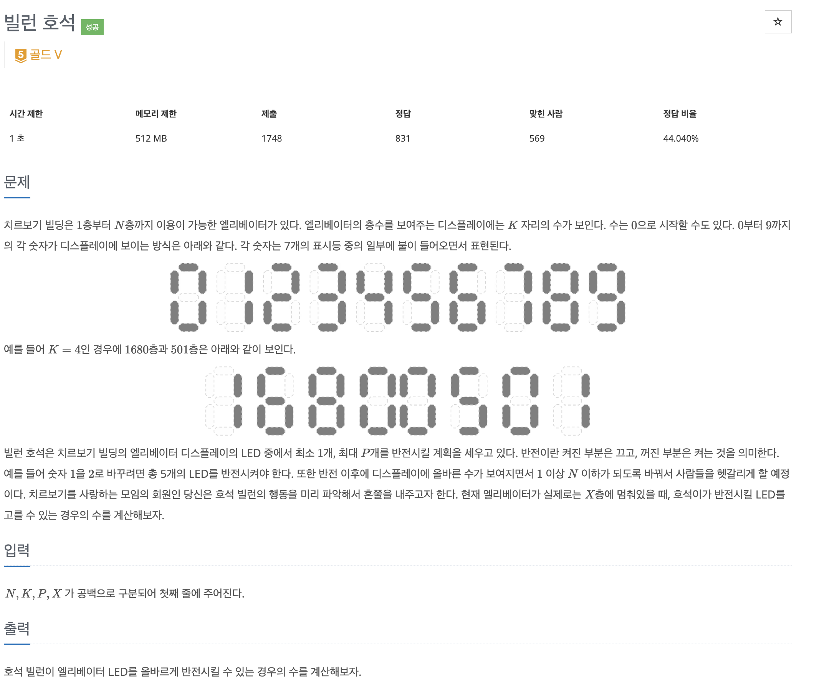

빌런 호석 문제 풀어보기

## [백준] 22251 빌런 호석

### 문제

### 풀이

이문제는 LED를 p개를 사용해서 만들 수 있는 숫자 표현들을 세어서 결과를 출력하는 문제였다. 층수를 나타내는 자릿수인 k의 최대가 6이므로 모든 경우의 수를 판단하는 방식으로 풀 수 있을 것이라고 생각했다.

그래서 먼저 1 ~ N까지의 층수를 모두 돌면서 현재 층수에서 P개 이하로 변경했을 때 표현할 수 있는지를 판단했다. 이때 주의해야 할 점은

1. 0번 바뀌는 경우는 세지 않는다.
2. 자릿수가 다른 숫자도 0으로 표현되어 있으므로 확인해야 한다. ex) 0010 vs 0101
3. 가장 중요햔 0 ~ 9까지의 표현을 주어진 대로 2차원 배열을 생성하자 나의 경우에는 7을 다르게 표현해서 틀렸다.

자세한 풀이는 아래 코드와 주석을 참고하면 될 것 같다.

### 코드

### 참고자료

[_백준 빌런 호석 풀러가기_](https://www.acmicpc.net/problem/22251)
