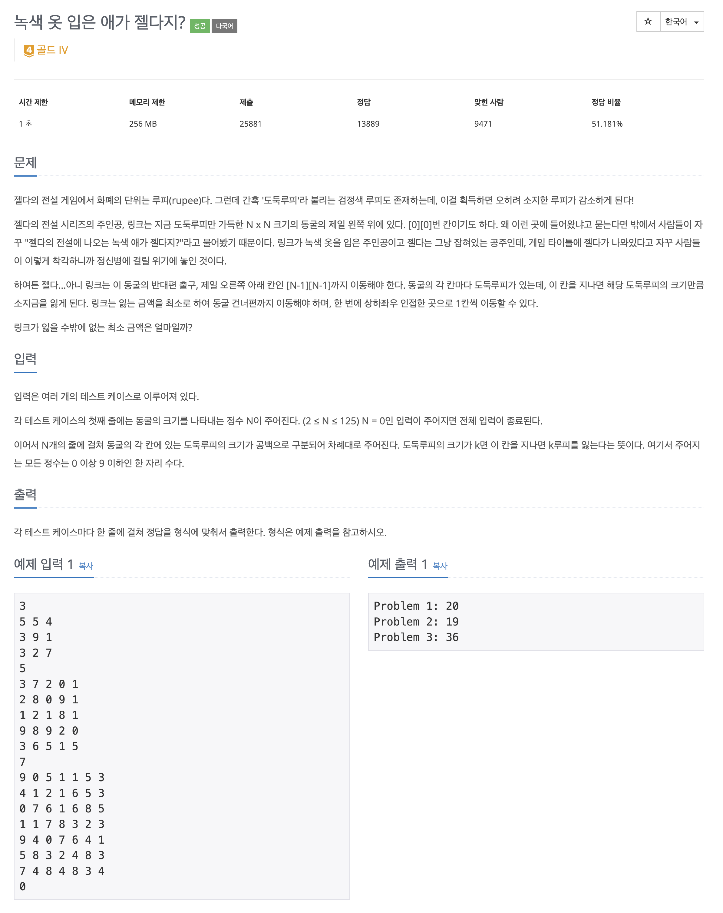

녹색 옷입은 애가 젤다지? 문제 풀어보기

## [백준] 4485 녹색 옷입은 애가 젤다지?

### 문제

### 풀이

이 문제는 bfs를 활용해서 푸는 문제였다. 2차원 배열이 주어졌을 때 (0, 0) -> (n - 1, n - 1)까지 가는데 드는 비용의 최솟값을 구해야 하는 문제였다. 이때 평범한 bfs라면 방문처리를 하고 중복된 위치는 방문하는 방식으로 하겠지만 이 문제의 경우에는 가중치의 최솟값을 구하는 문제이기 때문에 조금 수정이 필요했다.

1. 중복으로 방문하되 방문하지 않은 경우에는 방문한다.
2. 방문하려는 자리가 이미 방문한 경우 최솟값인지 확인하고 방문할지 안할지 결정한다.

이정도의 수정을 하게 된다면 손쉽게 풀 수 있는 문제였다.

### 코드

### 참고자료

[_백준 녹색 옷입은 애가 젤다지? 풀러가기_](https://www.acmicpc.net/problem/4485)
