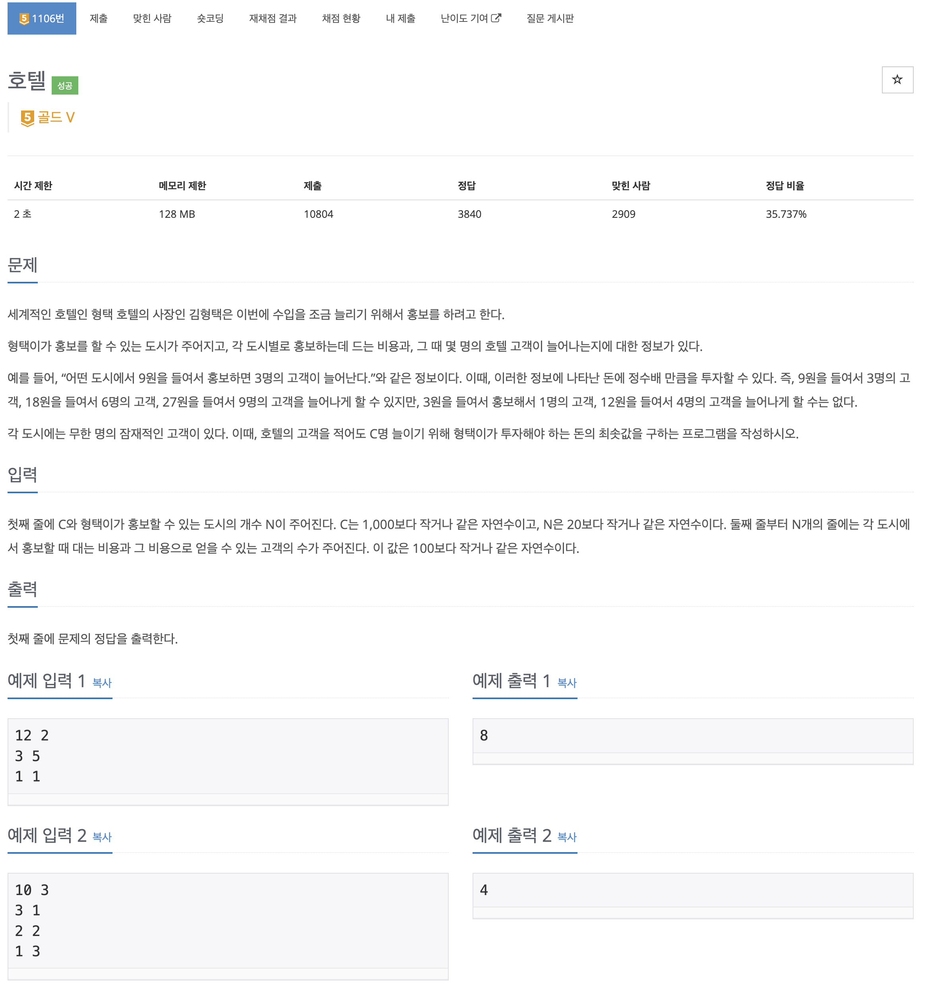

호텔 문제 풀어보기

## [백준] 1106 호텔

### 문제

### 풀이

이 문제는 고객을 c명이상 가지게 되는 경우에 최솟값을 가지는 경우를 찾는 문제였다.

문제를 보자마자 dp를 생각했다. 처음에는 고객의 수를 배열로 선언해서 고객을 기준으로 cost의 최솟값을 구하려고 했었다. 그러나 문제의 조건중에서 `고객을 적어도 c명 늘리기 위해서`라는 부분이 까다로웠다. 왜냐하면 c명을 구하기 위해 드는 비용을 구했을 때가 c 이상의 값을 구하기 위해 드는 비용보다 큰 경우가 있을 수 있어서 dp로 푸는 이유가 없었다.

그래서 드는 비용을 최소로 하기 위해서 비용을 기준으로 배열을 선언해서 풀이했다.

### 최소 비용 찾기

최대로 구해야하는 인원 수 = 1000명, 도시마다의 최대 비용 = 100이므로 최대 비용은 1000 \* 100 = 100000이다. 그래서 100001크기의 cost배열을 선언하고 1부터 100000까지 반복하는데 도시의 크기만큼 반복하면서 도시마다 드는 비용을 뺀 이전값에서 현재 도시에서 추가된 인원수를 저장된 값과 비교해서 모을 수 있는 인원의 최댓값을 저장한다.

그러다가 현재가격에 저장된 인원이 c보다 크거나 같은 경우 그 가격을 리턴한다.

이에 관한 코드는 solution메서드에서 확인할 수 있다.

### 코드

### 참고자료

[_백준 호텔 풀러가기_](https://www.acmicpc.net/problem/1106)
