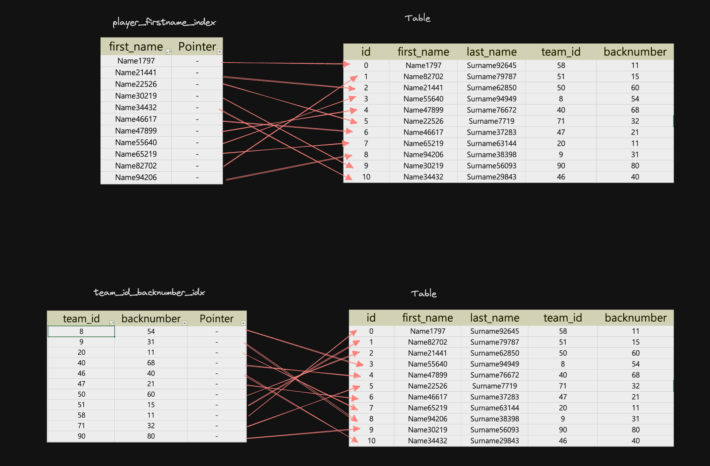

DB에서 INDEX를 사용하는 이유와 사용법을 알아보자

## INDEX 란?

DB INDEX는 추가적인 쓰기 작업과 저장 공간을 활용하여 데이커베이스 테이블의 검색 속도를 향상시키기 위한 도구이다.

### 장점

- 기존의 방식이였던 full scan 방식은 대규모의 데이터베이스나 수많은 요청을 처리할때 규모가 커질수록 속도가 느려지는 단점이 있다. 이 단점을 해소할 수 있는 것이 INDEX를 활용하는 방식이다.
- INDEX는 B-Tree로 이루어져 있고 찾아가는 방식도 full scan(O(N))이 아닌 binary search(이진 탐색)을 활용해 O(logN)의 처리 속도를 가진다.
- 조회가 빨라지는 장점도 있지만 Order by(정렬) Group by(그룹핑)의 속도도 빨라진다.

### 단점

- INDEX는 추가적인 저장 공간을 활용하기 떄문에 많아 질수록 많은 저장공간을 차지하게 된다.
- 많은 INDEX를 활용하게 되면 데이터를 추가하거나 삭제하는 경우 각각의 INDEX에서 제거하거나 추가하는 처리 과정을 거치게 되므로 처리 속도가 느려질 수 있다.
- 이미 데이터가 몇백만건이 존재할 때 INDEX를 추가하면 시간이 오래 걸릴 수도 있고 DB 성능에 좋지 않은 영향을 미칠 수 있다.

### Full Scan이 더 좋은 경우

- Table에 적은 양의 데이터가 존재하는 경우
- 조회하려는 데이터가 테이블의 상당 부분을 차지하는 경우 ex) 통신사를 분류했을 떄 3사 (SK, KT, LGU+)로 이루어진 경우가 대부분인 경우 이를 조회할 때는 full scan이 더 효율적일 수 있다.

### 동작 방식



SELECT 하는 방식을 예시로 들면

```sql
SELECT * FROM tablename WHERE first_name == "NAME44617"
SELECT * FROM tablename WHERE team_id == 51
```

- 하나의 조건만을 가지고 있는 INDEX

위와 같은 SELECT 문을 실행하면 DB의 Optimizer는 어떤 인덱스를 통해 구할지 정하고 찾는다. 이경우에는 team_id_backnumbe_idx라는 이름의 IINDEX에서 찾을 수 있다.

우리는 team_id을 기준으로 가지는 Index에서 찾을 때 이분 탐색을 통해 찾는다.

team_id = 8 인 데이터와 team_id = 90인 데이터의 중간에 있는 team_id = 46인 데이터와 우리가 찾는 “51”을 대조한다.

이때 중간값이 구하고자 하는 값보다 작기 때문에 46보다 작은 값들은 무시한다. 즉 우리는 team_id = 46 인 데이터와 team_id = 90인 데이터의 중간에 있는 team_id = 51과 우리가 찾는 “51”을 대조했을 때 같으므로 이때의 포인터를 통해 table에 해당하는 데이터를 뽑아낸다.

- 두개의 조건을 가지고 있는 INDEX

```sql
SELECT * FROM tablename WHERE team_id = 51 AND backnumber = 15
```

위와 같이 두개의 조건을 가지고 있는 INDEX의 경우 첫 번째로 앞에 있는 조건을 기준으로 오름차순 정렬한뒤, 두번째 조건을 오름차순으로 정리한다. 그래서 위에와 동일하게 이분 탐색으로 찾는 방식은 동일하다.

```sql
SELECT * FROM tablename WHERE backnumber = 15
SELECT * FROM tablename WHERE team_id = 51 OR backnumber = 15
```

그러나 위처럼 두번째 기준을 가지고 있는 backnumber를 기준으로 정렬하고자 한거나, team_id 또는 backnumber의 기준에 부합하는 경우를 모두 찾으려고 한다면, backnumber는 오름차순으로 정리되어 있지 않기 때문에 오히려 INDEX를 활용해서 찾는 것이 속도가 늦어질 수 있다.

그래서 DB에서는 Optimizer가 알아서 INDEX를 활용할지 Full Scan를 사용할지 정한다.

그럼에도 backnumber로 조회할 때 효율을 증가시키고 싶다면 backnumber INDEX를 생성하여 활용하는 편이 좋다.

### Covering index

INDEX는 포인터를 통해 직접 테이블의 요소를 가져올 수도 있지만 INDEX자체에서 활용이 끝나는 경우도 존재한다. 이러한 방식으로 효율을 극대화하는 기법을 Covering INDEX라고 한다.


```sql
SELECT team_id, backnumber FROM player WHERE team_id = 5;
```

위와 같이 이루어진 team_id_backnumber_idx를 활용할때 우리는 team_id와 backnumber의 경우는 포인터를 사용하지 않고 바로 INDEX표에서 출력할 수 있다. 이런식으로 Pointer를 사용하지 않고도 쿼리문을 처리하는 방식을 통해 효율을 극대화 할 수 있다.

### 사용법

- 생성되어 있는 테이블에 INDEX 생성하기

```sql
/* table에 first_name을 기준으로 가지는 INDEX */
CREATE
 INDEX player_first_name_index
		ON player(name);
/* table에 team_id, backnumber를 기준으로 가지는 UNIQUE INDEX(중복값 허용X) */
CREATE
UNIQUE
 INDEX team_id_backnumber_idx
		ON player(team_id, backnumber);
```

- 테이블을 생성할때 인덱스 동시에 생성하기

```sql
CREATE TABLE player(
	id INT PRIMARY KEY,
	name VARCHAR(20) NOT NULL,
	team_id INT,
	backnubmer INT,
	INDEX player_name_idx(name),
);
```

- 생성된 INDEX 확인하기

```sql
SHOW INDEX from indexTBL;
```

- INDEX 삭제하기

```sql
/* 인덱스 삭제하기 */
DROP INDEX team_id_backnumber_idx ON indexTBL;
```

- SELECT

```sql
/* 조회하기 */
SELECT * FROM indexTBL WHERE team_id = 100;

SELECT * FROM indexTBL WHERE team_id =100 AND backnumber = 20;

SELECT * FROM indexTBL WHERE first_name = "Name200";
```

- SELECT Detail 보기

```sql
/* 인덱스 삭제하기 */
DROP INDEX team_id_backnumber_idx ON indexTBL;
```

- INDEX 강요하기

```sql
/* 어떤 인덱스가 사용되도록 강요하기 */
EXPLAIN
SELECT * FROM indexTBL USE INDEX (team_id_backnumber_idx)
WHERE team_id = 100 OR backnumber = 20;

EXPLAIN
SELECT * FROM indexTBL FORCE INDEX (team_id_backnumber_idx)
WHERE backnumber = 20;
```

### 참고 출처

1. [쉬운 코드 유투브](https://www.youtube.com/watch?v=IMDH4iAQ6zM)
