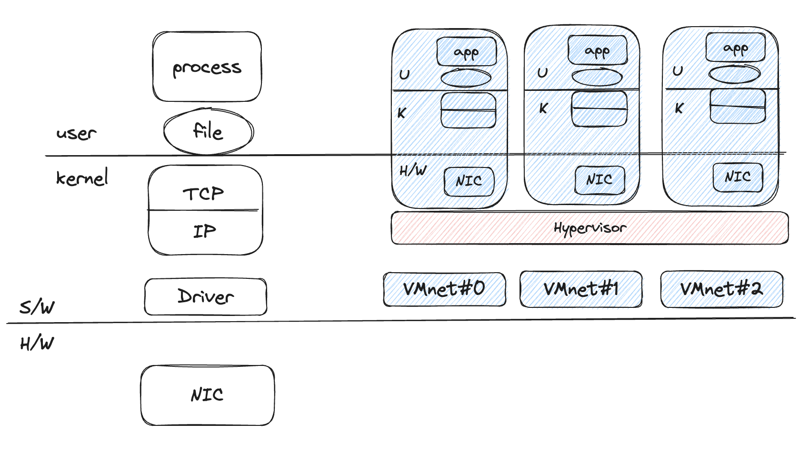
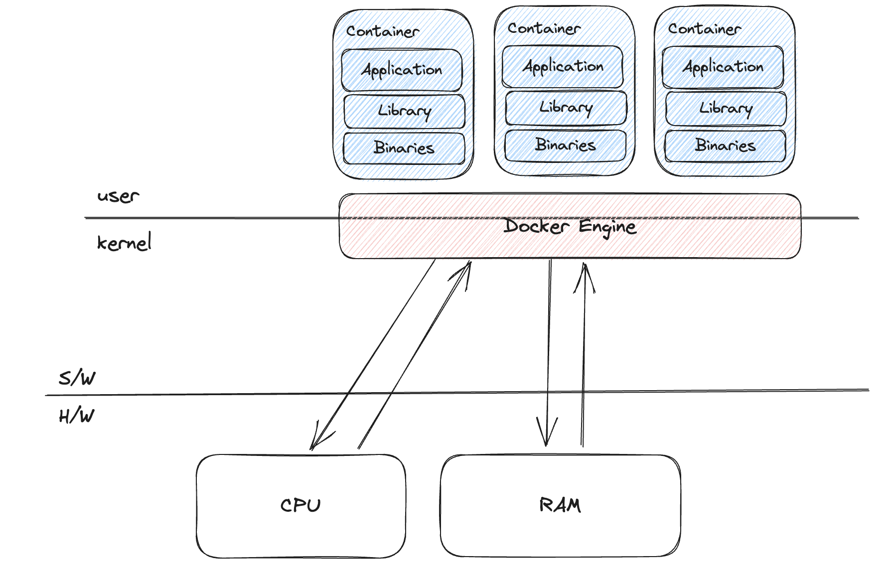

개발자들이 많이 사용하는 도커가 무엇인지, 어떻게 작동하는지 알아보자

## 도커?

도커는 컨테이너에 어플리케이션을 프로세스 격리기술을 사용하여 더 쉽게 컨테이너로 실행하고 관리할 수 있게 하는 오픈소스 프로젝트다.

쉽게 말하면 어플리케이션을 컨테이너로 패키징 할 수 있다는 의미가 된다. 우리 어플리케이션 소스코드 뿐만 아니라 환경설정이나 Dependency를 같이 패키징 하여 OS에 의존을 없애 어떠한 컴퓨터에서도 구동할 수 있게 만들어주는 툴이다.

예를 들어 node.js로 개발한 어플리케이션을 개발자의 컴퓨터인 윈도우에서 개발을 마치고 서버를 통해 배포하려고 할 때 서버의 컴퓨터가 리눅스 OS라면 환경변수와 node.js설치, npm설치등 여러가지를 건드리고 설정해야 하지만,

만약 도커를 활용한다면 도커 컨테이너 안에 npm, node.js, dependencies(외부라이브러리 사용시), configs(환경변수 등)을 모두 패키징해서 서버 컴퓨터에 구동할 수 있다는 점이다.

## 도커 vs VMware

도커를 생각할때 우리는 가상머신과 비교될 수 밖에 없다. 구동방식이 비슷하지만 다른점이 많기 때문이다. 또 도커가 가상머신에 비해 훨씬 속도가 빠르다는 점을 가상머신과 빗대어서 설명할 수 있다.

### 가상머신(VMware)

우리가 알고 있는 가상 머신들은 아래와 같은 구조를 가지고 있다.

|                     가상머신                     |
| :----------------------------------------------: |
|  |

컴퓨터의 소프트웨어 공간에 Hypervisor(VMwere or VirtualBox)위에 가상의 컴퓨터(가상머신)을 생성하고 가상머신이 어플리케이션을 구동할 때 필요한 자원들을 Hypervisor가 기존의 컴퓨터의 자원을 사용하고 그 결과를 가상머신으로 전달해주는 방식이다.

이러한 가상머신은 컴퓨터내에 여러대의 컴퓨터가 존재하는 것이기도 하고 각각의 머신에 OS를 탑재하여 구동하다보니 매우 느리고 프로그램도 굉장히 무거워 지는 단점을 가지고 있다.

### 반면 도커는?

|                     가상머신                     |
| :----------------------------------------------: |
|  |

도커의 구성을 살펴보면 우리가 보았던 가상머신과는 다르게 H/W와 S/W의 Kernel 모드에서 사용하던 공간이 사라지고 어플리케이션, Library, Binaries가 묶여 있는 컨테이너만 존재하고 Hypervisor 대신 Docker Engine이 자리잡고 있는 것을 볼 수 있다.

그렇다면 이와 같은 상황에서 도커엔진이 하는 역할이 무엇일까? 앞서 Hypervisor와 동일하게 Container의 어플리케이션이 구동되는데 필요한 자원들을 Host 자원에서 사용하고 그 결과를 다시 어플리케이션으로 전달해주는 역할을 한다.

이처럼 도커는 가상머신과 달리 각각의 OS를 설치하거나 할 필요가 없고 도커 엔진을 설치하고 도커를 통해 컨테이너로 생성하여 구동하기 떄문에 가상머신과 비교도 될 수 없이 빠르고 가볍다.

## 도커의 구성요소

|                                                도커 구동 순서                                                 |
| :-----------------------------------------------------------------------------------------------------------: |
|  |

### 도커파일

컨테이너를 구성하는데 필요한 파일들, 외부 Dependencies(사용되는 프레임워크등), 환경변수와 같은 환경설정, 구동순서를 설명해주는 스크립트를 포함하여 도커에게 도커이미지 파일을 만드는데 필요한 레시피를 전달해주는 파일이다.

### 이미지

이미지는 어플리케이션을 구동하는데 필요한 소스파일, 자원들(이미지 등), 외부라이브러리 dependencies, 환경변수와 같은 환경설정들과 프레임워크등에 도커파일까지 합쳐진 것을 snapshot해서 만든파일로 수정이 불가하다.

### 컨테이너

컨테이너는 도커이지를 활용해 실행시키는 역할을 한다.

### 순서

도커가 구동하기 위해서는 일단 도커파일을 만들고 -> 도커파일을 포함한 도커이미지를 생성해서 컨테이너에 넣어주면 컨테이너 안에서 구동되는 방식이다.

## 도커 배포과정

|                                                          도커 배포과정                                                           |
| :------------------------------------------------------------------------------------------------------------------------------: |
| .png>) |

그렇다면 우리가 만든 도커의 이미지를 서버에 배포하기 위해서는 어떤과정을 거쳐야 할까?

우리의 로컬 PC에서 생성된 도커의 이미지를 서버에 전달해주기 위해서는 Container Registry라는 저장소를 주로 사용하는데 github와 비슷한 공간인 dockerhub등의 퍼블릭한 저장소가 있고, 반면 우리가 주로 사용하는 클라우드 서비스에도 Docker Continaer Registry를 지원하는데 만약 private한 도커 저장소가 필요한 경우 주로 사용된다.

즉 우리는 로컬에서 만든 도커이미지를 저장소로 push 하고, 서버에서 pull 하여 구동하는 방식으로 배포가 완료되는 것이다. 이때 로컬과 서버에 모두 docker가 설치되어있어야 한다.

### 참고 출처

1. [널널한 개발자 : 도커, 가상화 이해하기](https://www.youtube.com/watch?v=zh0OMXg2Kog)
2. [드림코딩 도커 한방에 정리](https://www.youtube.com/watch?v=LXJhA3VWXFA)
3. [노마드코더: Docker 5분 설명](https://www.youtube.com/watch?v=chnCcGCTyBg)
