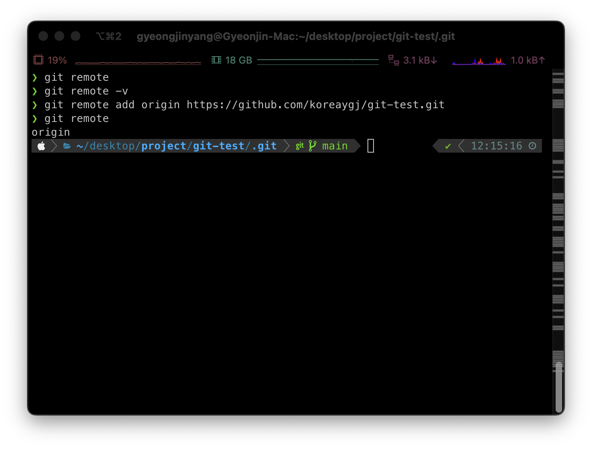
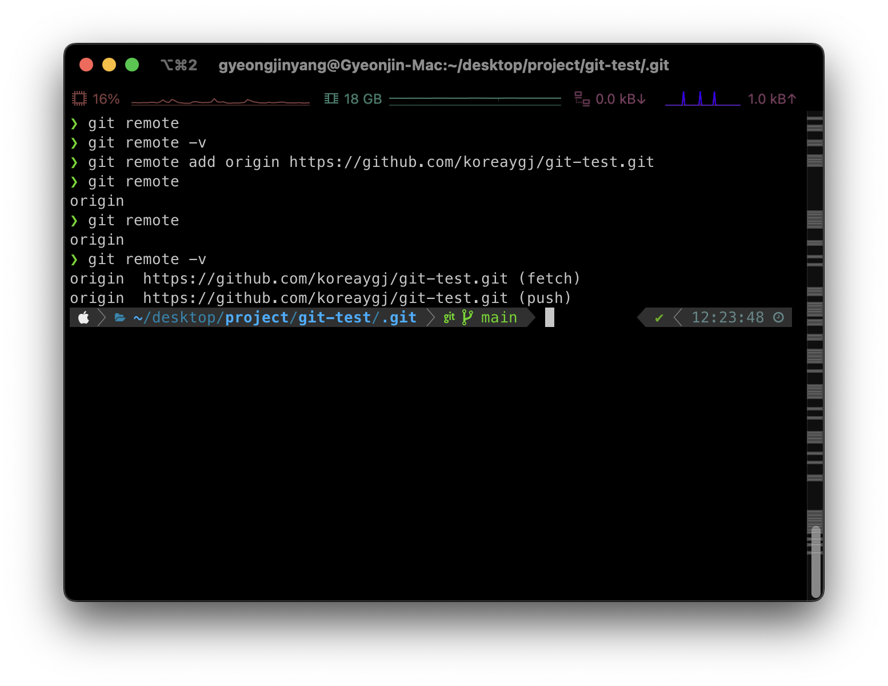
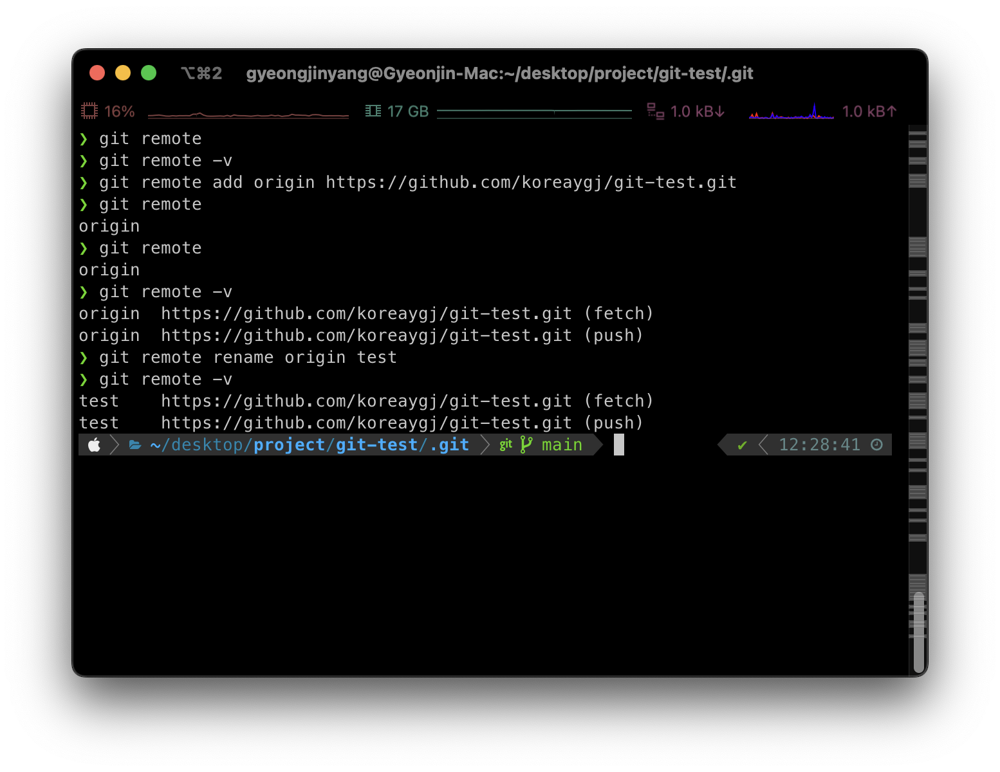
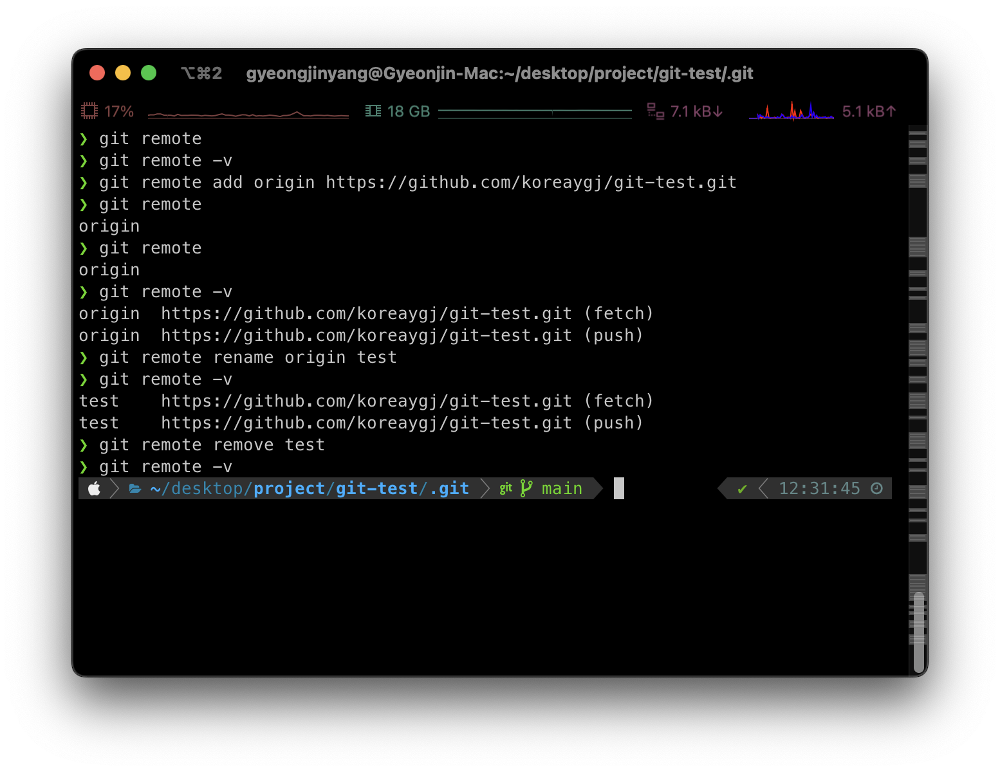

Github에 위치한 원격저장소에 로컬 저장되어있는 .git을 연결하기 위해서는 remote명령어를 사용하여 원격 저장소 연결, 삭제, 이름 변경할 수 있다. 이를 정리하고 익혀보자

# git remote

아무런 동작없이 `git init` 명령어만 되어있는 .git 레포지토리는 빈 레포지토리로 변경사항이나 변경사항을 보내줘야하는 Github 레포지토리가 연결이 되어있지 않은 상태이다. 현재 로컬 레포지토리의 .git과 Github의 레포지토리를 연결하기 위해 사용하는 명령어가 `git remote add`이다.

## 원격 저장소 연결하기

로컬 레포지토리와 Github를 연결해보자  
앞서 만든 Github 레포지토리 첫 페이지에 나와 있는 URL을 사용하면 된다. 필자의 경우 "https://github.com/koreaygj/git-test.git"이다.

```bash
// 원격저장소 == Github 레포지토리
$ git remote add <원격 저장소 name> <원격 저장소 URL>
// 실제 연결하기
$ git remote add origin "https://github.com/koreaygj/git-test.git"
// 원격 저장소가 생겼는지 확인
$ git remote
```

|-------|-----:|
| |remote add <br> 결과화면|

## 원격저장소 확인하기

원격저장소의 연결이 되었는지 확인하기 위해서는 git remote 또는 git remote -v를 사용하여 확인할 수 있다.

```bash
// 원격저장소 이름만 확인하기
$ git remote

// 원격저장소 이름과 주소까지 확인하기
$ git remote -v
```

|-------|-----:|
| |remote -v <br> 결과화면|

## 원격저장소 이름변경

원격저장소의 이름을 잘못 작성했을때는 git remote rename을 통해 수정할 수 있다.

```bash
$ git remote rename <old name> <new name>
// 새로운 원격저장소 이름으로 변경
$ git remote rename origin test
// 변경되었는지 확인
$ git remote -v
```

|-------|-----:|
| |rename <br> 결과화면|

## 원격저장소 삭제

원격저장소의 URL을 잘못작성하였거나 필요가 없어졌을때는 git remote remove를 통해 삭제할 수 있다.

```bash
$ git remote remove <name>
// 원격저장소 삭제
$ git remote remove test
// 삭제되었는지 확인
$ git remote -v
```

|-------|-----:|
| |remove <br> 결과화면|

references  
[git 공식문서](https://git-scm.com/docs/git-remote)  
[choiis Devlog](https://choiiis.github.io/git/how-to-remote-project/)
