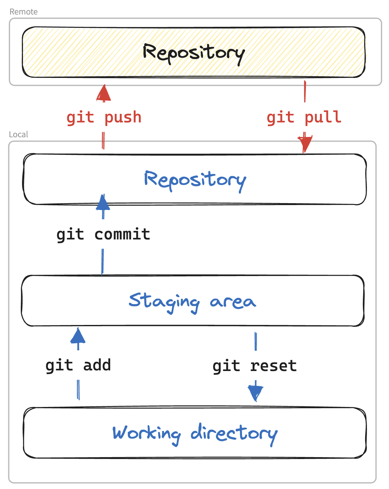
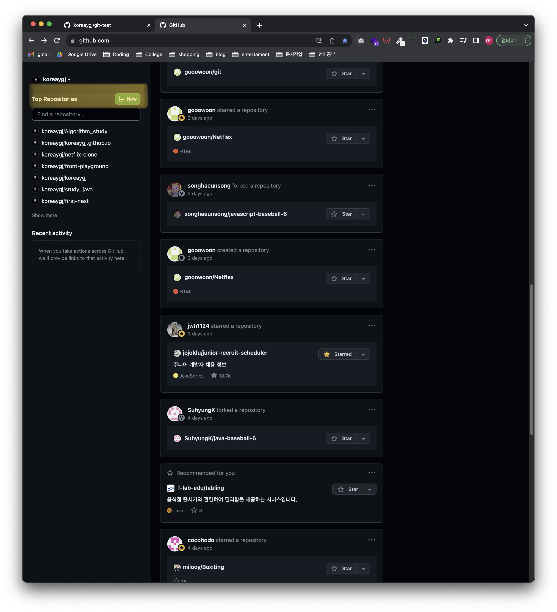
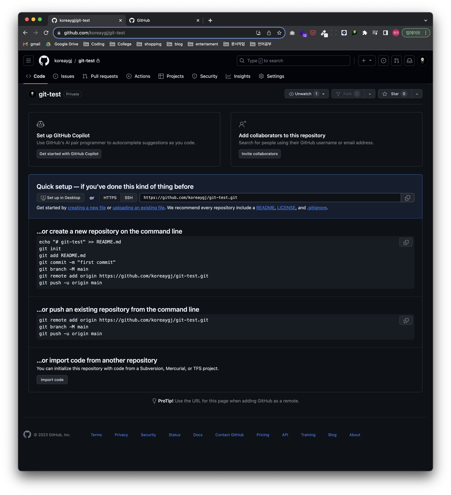
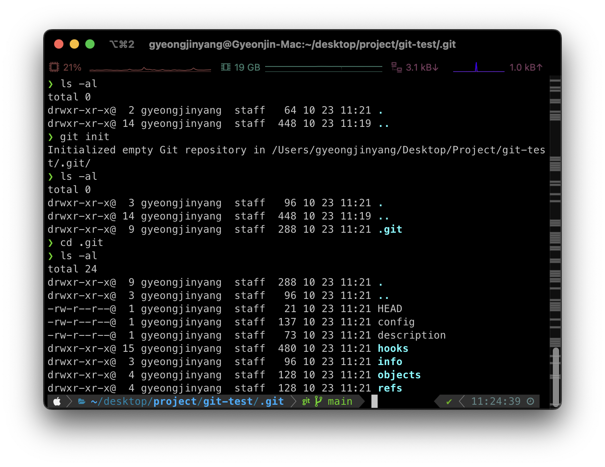
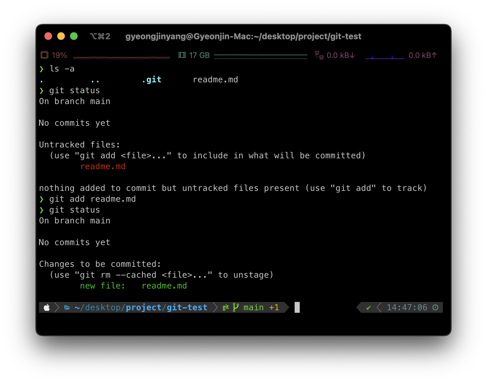
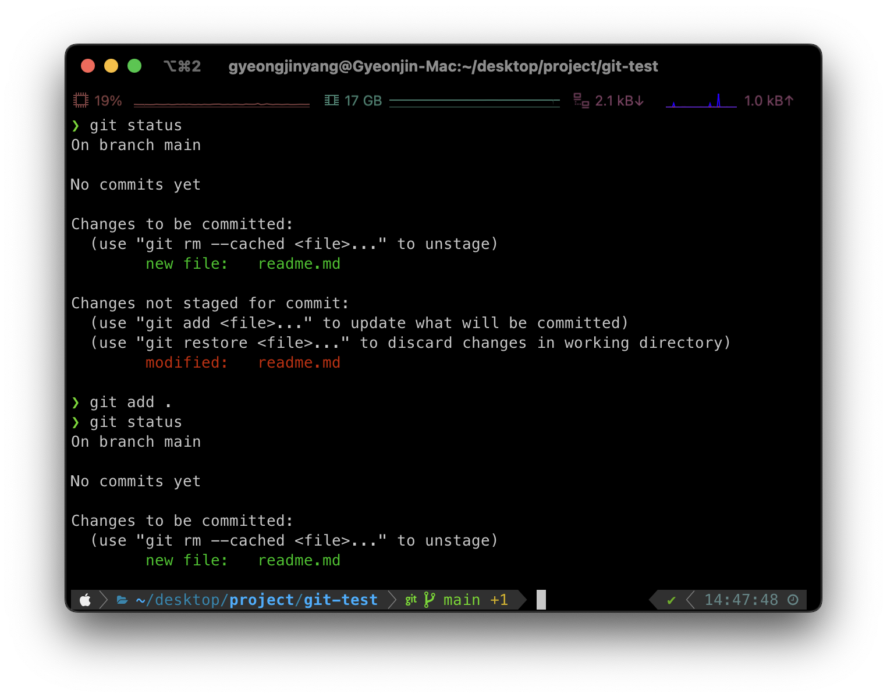
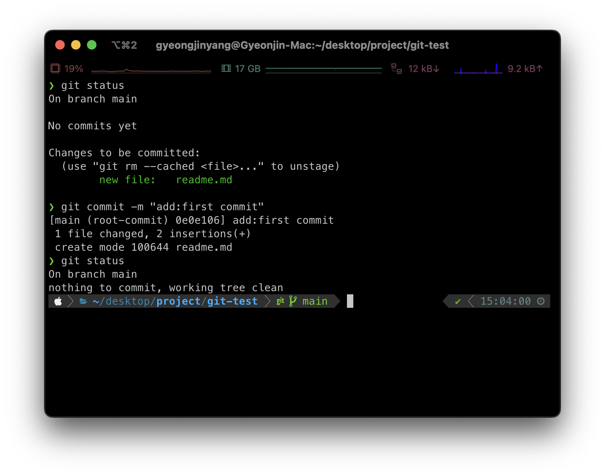
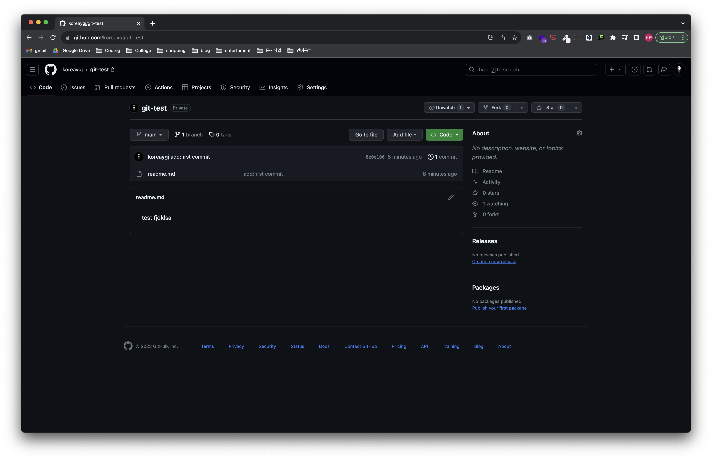

개발에 필수적으로 쓰이고 협업을 위한 필수적인 툴인 깃을 명령어를 통해 사용하는 방법을 알아보자!

## 원격 레포에 추가하는 과정

|           local에서 remote 레포지토리에 추가하는 과정           |
| :-------------------------------------------------------------: |
|  |

|:-----|:----|
| Local working directory | 현재 사용자가 활용하는 프로젝트의 폴더|
| Local Staging area| 커밋을 하기 직전에 추가한 파일들이 대기하는 공간 Git에서는 이공간을 활용해서 커밋직전 파일들을 수정하거나 커밋을 하기 전에 파일들을 확인할때 편한 장점을 가지고 있다.|
| Local Repository| 커밋 메시지를 작성하면 커밋들이 모여있는 저장소 원격 레포지토리로 가기 직전의 공간이다.|

## github 새로운 레포지토리 만들기

git을 통해 프로젝트 파일을 관리하기 위해서는 github에 프로젝트 레포지토리를 생성해놓아야 한다.

| 노란색으로 색칠된 부분을 클릭하면 새로운 레포지토리를 생성할 수 있다. |
| :-------------------------------------------------------------------: |
|                    |
|                         생성된 레포의 첫 화면                         |
|                        |

## git init

git은 버전 관리를 위해 분산 버전 시스템을 이용하기 때문에 우리가 작업하는 프로젝트에 하위 디렉토리인 `./.git`을 생성하고 이 폴더에서 프로젝트 파일의 변화를 시간순서대로 관리한다. 우리가 만든 프로젝트 폴더에 git을 위한 빈 Git repository(./.git)을 생성하기 위한 명령어이다.

```bash
$ git init
```

git init은 refs/heads, refs/tags, 템플릿파일의 하위 디렉토리가 있는 .git 디렉토리를 만든다.

|                  git init 결과화면                  |
| :-------------------------------------------------: |
|  |

## git remote add

현재 .git 레포지토리는 빈 레포지토리로 변경사항이나 변경사항을 보내줘야하는 Github 레포지토리가 연결이 되어있지 않은 상태이다. 현재 로컬 레포지토리의 .git과 Github의 레포지토리를 연결하기 위해 사용하는 명령어가 `git remote add`이다.

### 원격 저장소 연결하기

로컬 레포지토리와 Github를 연결해보자  
앞서 만든 Github 레포지토리 첫 페이지에 나와 있는 URL을 사용하면 된다. 필자의 경우 "https://github.com/koreaygj/git-test.git"이다.

```bash
// 원격저장소 == Github 레포지토리
$ git remote add <원격 저장소 name> <원격 저장소 URL>
// 실제 연결하기
$ git remote add origin "https://github.com/koreaygj/git-test.git"
// 원격 저장소가 생겼는지 확인
$ git remote
```

원격 저장소 연결을 포함한 여러가지 `git remote`에 알아보려면 아래링크를 참조

[git remote 정리](https://koreaygj.github.io/cs/Git_remote/)

---

## git add

현재 로컬에서 프로젝트의 수정된 사항을 Github레포지토리로 올리기 전에 처음으로 파일의 변경사항을 Staging area에 추가해야 한다. 그 역할을 수행하는 명령어가 `git add`이다.

```bash
//현재 변경사항 상태확인
$ git status
// git add <파일경로 or directory경로> (단일 파일만 Staged area로 추가하거나 directory경로내에 모든 변경사항 저장)
$ git add .
// git add -A (프로젝트 디렉토리의 모든 변경사항 Staged area로 추가)
```

|             git add <파일이름> 결과화면             |
| :-------------------------------------------------: |
|  |

|                 git add . 결과화면                  |
| :-------------------------------------------------: |
|  |

## git commit

Staged area에 추가된 변경사항들을 커밋메시지와 함께 로컬 레포지토리에 저장해두는 명령어이다.

```bash
$ git status
// git commit -m <커밋메시지>
$ git commit -m "add:first commit"
$ git status
```

|                git commit -m 결과화면                 |
| :---------------------------------------------------: |
|  |

## git push

로컬 레포지토리에서 원격 레포지토리로 전송해주는 명령어이다. 원격 저장소 이름과 원격 저장소의 branch를 사용해야 한다. branch는 초기 설정은 `main`과 `maste`중에 하나를 사용한다.

```bash
// git push <remote이름> <branch이름>
$ git push origin main
```

|                  git push 결과화면                  |
| :-------------------------------------------------: |
|  |

---

`git push`이후 github 레포지토리를 확인해보면 업데이트가 되어있는 것을 알 수 있다.

|                      github 확인                       |
| :----------------------------------------------------: |
|  |

### references

[git 공식문서](https://git-scm.com/docs)
