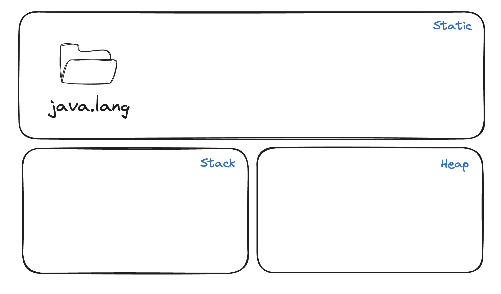

자바의 main() 메서드가 실행될 때 메모리의 데이터 저장영역(T 메모리 구조)를 살펴보자

## T-메모리 구조

하나의 프로그램이 실행될 때 프로그램은 코드 실행 영역과 데이터 저장 영역을 나누어 사용한다. Java의 경우 객체 지향 프로그램으로 데이터 저장영역이 `Static 영역` `Stack 영역` `Heap 영역`이 T모양으로 나뉘어져 있는 모양을 하고 있다.

|                                                    |
| :--------------------------------------------------------------------------------------------------: |
| Static 영역 - 클래스들의 놀이터 <br> Stack 영역 - 메서드들의 놀이터 <br> Heap 영역 - 객체들의 놀이터 |

## 메서드 스택 프레임

프로그램이 시작되는 main()메서드가 실행될 때 T-메모리에 일어나는 일들을 그림과 함깨 살펴보자

```java
  public class start {
    public static main(String args[]){
      System.out.println("Hello OOP!!!");
    }
  }
```

### 전처리 과정

프로그램이 시작되기 전 `JRE(Java Runtime Environment) 자바 개발 환경`이 main() 메서드가 존재하는지 확인한다. 이때 JRE가 main() 메서드를 start 클래스에서 발견하고 JRE는 가상 머신인 JVM(Java Virtual Machine)을 실행시킨다. JVM은 목적 파일을 받아 실행시킨다. 첫번째로 JVM은 Java 파일을 실행시키기 전에 전처리 과정을 진행시킨다. 이때 모든 자바 프로그램이 반드시 포함하게 되는 `java.lang 패키지`를 T-메모리의 `Static 영역`에 가져다 놓는다.

|:---:|
| |

다음으로 JVM은 개발자가 작성한 모든 클래스와 import 클래스도 Static 영역으로 가져다 놓는다. 예시 코드에는 start class만 존재하므로 static 영역으로 가져다 놓는다.

|:---:|
| |

### 전처리 후

전처리 과정이 끝났지만 바로 System.out.println("Hello OOP!!");가 실행되지 않는다. main() 메서드와 같이 메서드가 존재하는 영역은 stack 영역이다. 따라서 main() 메서드가 시작되는 중괄호("{")로 Stack 영역 main()메서드 스택 프레임이 할당된다.

|:---:|
| |

메서드가 Stack 영역에 할당되고 마지막으로 남은 메서드 인자를 저장할 변수 공간을 main() 스택 프레임의 맨밑에 확보하고 메서드 인자들의 변수 공간을 할당해야 한다. 예시의 경우 args를 저장할 변수 공간을 main() 스택 프레임의 맨밑에 확보하고 할당한다. `이 모든 과정이 이루어져야 main()메서드의 첫 명령문이 실행된다.`

### 명령이 실행과 이후

우리가 원한 구문 System.out.println("Hello OOP!!!"); 이 실행되면 T-메모리(데이터 저장 영역)가 아닌 코드 실행 영역의 메모리에 변화가 이루어진다. 구문이 코드 실행 공간에서 실행되면 GPU에 화면 출력을 의뢰한다. 이때 T-메모리는 현재 상태에서 변화가 없다.

구문이 실행되고 난 후에 main()메서드 스택 프레임이 중괄호("{")에 도달할 때 만들어지고 중괄호("}")에 도달했을 때 소멸된다. main() 메서드가 종료되면 JRE는 JVM을 종료시키고 JRE또한 운영체제의 메모리에서 소멸된다.

### 참고자료

[스프링 입문을 위한 자바 객체지향의 원리와 이해 - 김종민]
