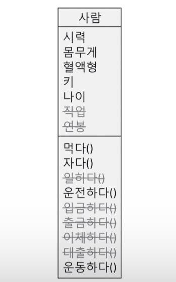
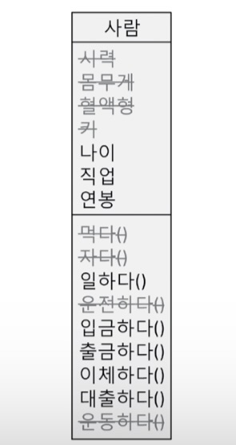
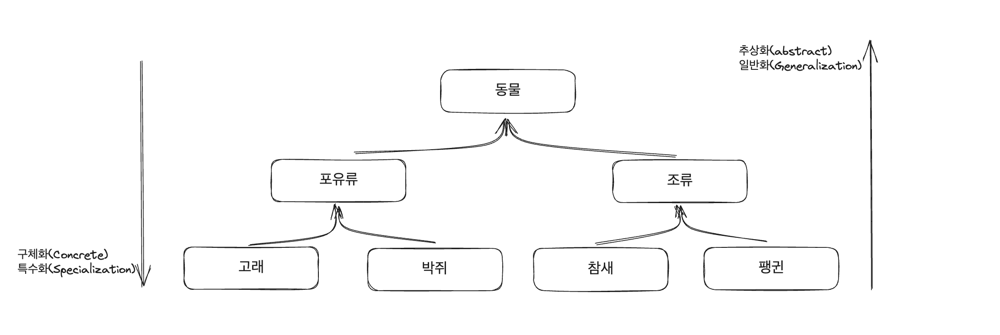
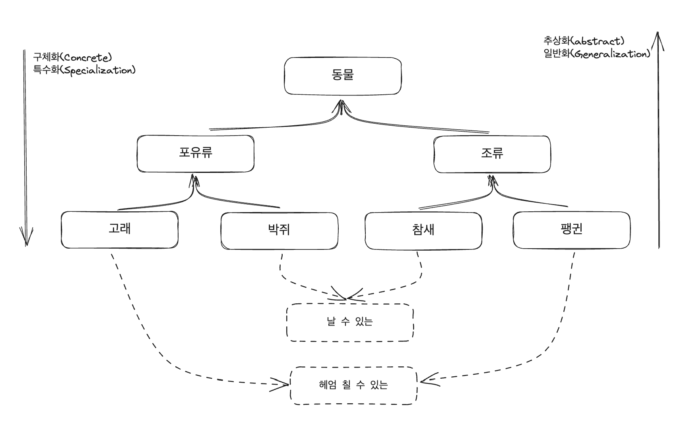
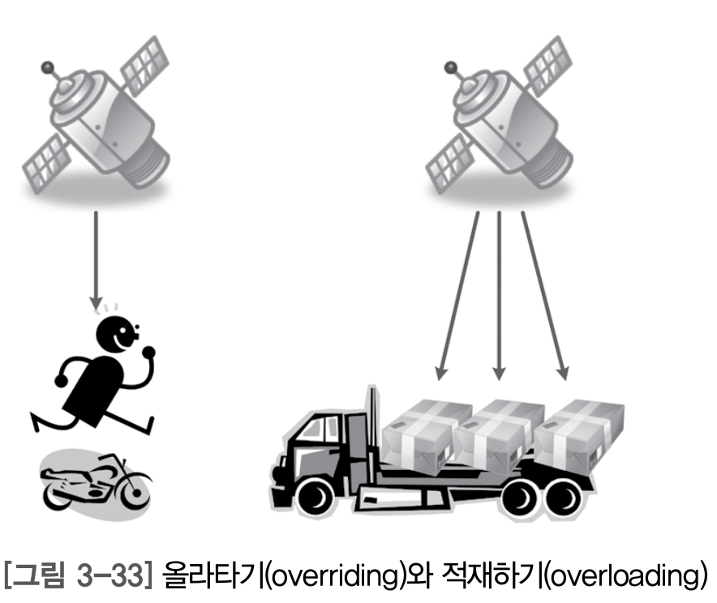

자바가 왜 객체지향 언어인지 확인해보자

## 객체지향이란?

우리가 살고 있는 세계에서는 사물로 가득하다. 지금 당장 주위를 둘러보면 키보드, 옷, 가방, 안경등 우리의 삶에는 수많은 사물로 가득하고 이 사물을 좀 더 있어보이는 말로 `객체`라고 한다. 영어로는 `Object`이것이 객체지향 프로그래밍이 생겨나게 된 이유이다. "우리가 주변에서 사물을 인지하는 방식대로 프로그래밍하자"가 어찌보면 객체지향 프로그래밍의 내재된 의미이다.

그렇다면 우리가 존재하는 세상에서의 사물을 생각해보자

- 세상에 존재하는 모든 것은 사물(Object)
- 각각의 사물은 고유하다.
- 사물은 속성을 가진다.
- 사물은 행위를 한다.

우리는 사물을 분류(Class)해서 이해한다.

- 사람: 직립보행을 하며 말을 하는 존재
- 펭귄: 연미복을 입은 듯한 털, 날지 못하는 새
- 별: 밤하늘에 반짝이는 사물들

사람에 대해서 생각해보자 고윤정(object), 한소희(object), 아이유(object) 이러한 고유한 object는 사람으로 분류된다. 그리고 이 객체(object)들은 나이, 몸무게, 키 등의 속성(property)과 먹다, 자다, 울다, 일하다 등의 행위(Method)를 가지고 있다.

| class 명 | 사람                               |     | 고윤정 | 객체명                             |
| -------- | ---------------------------------- | --- | ------ | ---------------------------------- |
| 속성들   | 나이 <br> 몸무게 <br> 키           |     | 속성들 | 나이:27 <br> 몸무게:50 <br> 키:163 |
| 행위들   | 먹다 <br> 자다 <br>울다 <br>일하다 |     | 행위들 | 먹다 <br> 자다 <br>울다 <br>일하다 |

## 클래스 vs 객체

자바에서 클래스와 객체를 선언하는 선언문을 보자

```java
  //클래스 객체참조 변수 new 클래스()
  Human goo = new Human()
```

앞선 예제 사람, 고윤정, 한소희, 아이유를 보면 클래스와 객체의 차이가 무엇일까? 전혀 감이 잡히지 않을 수 있다. 이때 구분하는 방법은 나이와 같은 특성을 물어보는 것이다.

- 사람은 몇 살 인가?
- 고윤정은 몇 살 인가?
- 한소희은 몇 살 인가?
- 아이유은 몇 살 인가?

고윤정 한소희 아이유는 나이에 대한 질문에 답변할 수 있다. 그래서 객체이다. `객체는 실체`  
그러나 사람의 나이를 물어보는 질문에는 답이 존재하지 않는다. 그래서 클래스이다. `클래스는 분류에 대한 개념`

### 추상화

객체지향의 4대 특징은 추상화 상속 다형성 캡슐화로 표현되는데 이 표현은 굉장히 직관적이지 못하다. 정말 이해하기 쉽지 않고 이를 설명하기도 쉽지 않다. 그래도 차근차근 생각해보자

그림에서 추상화를 잘하는 인물을 고르라고 하면 많은 사람들이 피카소를 생각한다. 그림에서의 추상화는 `Abstract Painting`이고 전산 분야의 추상은 `Abstract`이다. 같은 단어로 의미가 같다고 볼 수 있다. 그래서 추상화를 보면 우리는 힌트를 찾을 수 있지 않을까?

피카소에 앞서서 추상화를 그린 사람들이 있다. 고대 이집트 벽화에서 추상화를 볼 수 있다. 이 벽화들은 사람의 정면, 측면을 섞어서 표현했다. 예를 들어 얼굴은 측면, 몸통은 정면, 하체는 다시 측면을 그리는 방식이다. 이집트의 벽화를 그린사람들은 각 부분의 특징을 가장 잘 표현할 수 있도록 신체를 표현했다고 한다. `각각의 인물의 특징을 살리기 위해서 추상화를 그렸다는 이야기이다.`

그럼 추상과 추상화 사전적인 의미는 무엇인가?

> 추상: 여러 가지 사물이나 개념에서 공통되는 특성이나 속성 따위를 추출하여 파악하는 적용
>
> 추상화(그림): 사물의 사실적인 표현이 아니고 순수한 점, 선, 면, 색체에 의한 표현을 목표로 한 그림, 일반적으로는 대상의 형태를 해체한 입체파 등의 회화도 포함된다.
>
> 추상화: 추상적인 것으로 됨 또는 그렇게 만듬

사전적인 의미를 좀더 직관적으로 표현한다면, `구체적인 것을 분해해서 관심 영역에 대한 특성만을 가지고 재조합하는 것`이라고 생각할 수 있다. 이 정의를 IT 용어를 섞은다면

> 추상화란 구체적인 것을 분해해서 관심 영역(애플리케이션 경계)에 있는 특성만을 가지고 재조합하는 것! ` = 모델링`

| 애플리케이션 경계 |                    병원 애플리케이션                    |                    은행 애플리케이션                    |
| :---------------: | :-----------------------------------------------------: | :-----------------------------------------------------: |
|     사람이란      |                      사람은 환자다                      |                    사람은 고객이다.                     |
|   클래스 모델링   |  |  |

위의 예시를 보면 확실하게 추상화는 모델링이라고 생각할 수 있다. 이런 추상화는 객체지향에서 클래스를 설계할 때 필요한 기법이다. `실제와 똑같이 만드는 것이 아닌 목적에 맞게 필요한 특성만을 추출해서 표현하는 것이다.`

## 상속

한글로 표현된 상속은 실제 자바의 상속과는 거리가 느껴지는 표현이다. 상속은 재사용과 확장의 의미로 이해하는 것이 좀 더 정확한 해석이다. 객체지향에서의 상속은 상위 클래스(분류)의 특성을 하위 클래스에서 상속하고 거기에 더해 필요한 특성을 추가(확장)해서 사용할 수 있다는 의미다.

결국 우리가 이전에 자주 사용했던 부모 클래스 - 자식 클래스라는 표현보다는 `상위 클래스 - 하위 클래스` 나 `슈퍼 클래스 - 서브 클래스`라는 표현이 좀 더 정확한 표현이며, 객체지향에서 상속은 `확장, 세분화, 슈퍼 클래스 - 서브 클래스`의 개념으로 이해하는 것이 편하다. 그리고 상위 클래스 쪽으로 갈수록 추상화, 일반화 되었다고 표현하고, 하위 클래스로 갈수록 구체화, 특수화 되었다고 표현한다.

|                  객체 지향의 상속                  |
| :------------------------------------------------: |
|  |

객체 지향 설계 5원칙 중 리스코프 치환 원칙을 나타내는 말인 `하위 클래스는 상위 클래스이다.`를 위의 분류도에 적용하면,

- 표유류는 동물이다.
- 고래는 표유류다.
- 고래는 동물이다.

이와 같이 모두 자연스럽다. 또한 코드로 표현하면,

```java
  // 동물 뽀로로 = new 팸귄();
  // 새로운 팽귄에게 동물 역할의 뽀로로라 이름 짓다.
  Animal pororo = new Panguin();
```

충분히 이해가 되는 해석이다.

게다가 java에서는 상속을 inheritance(상속)이라는 키워드가 아닌 `extend(확장)`으로 사용한다. 이는 객체지향의 상속이 확장의 개념이라는 것을 java의 아버지인 제임스 고슬링이 알려주고 있다.

> 팽귄 is a 동물 ..??

상속관계가 주로 is a 관계를 만족한다고 표현하는 경우가 많다 예를 들어 팽귄 is a 동물 같은 표현은 해석하면 "팽귄은 한마리의 동물이다"라고 이해된다. 그러나 이때 "한마리의 동물"은 클래스가 아니라 객체라는 것을 알 수 있다. 이는 is a 관계는 상속을 설명하기엔 부족한 표현이라는 것을 알 수 있다.

이보다 명백한 표현을 마이크로소프트 개발자 사이트 MSDN에서 찾을 수 있었다. 바로 `is a kind of`관계이다.

- 하위 클래스 is a kind of 상위 클래스
- 팽귄 is a kind of 조류 → 팽귄은 조류의 한 분류이다.
- 펭귄 is a kind of 동물 → 펭귄은 동물의 한 분류다.
- 고래 is a kind of 동물 → 고래는 동물의 한 분류다.
- 조류 is a kind of 동물 → 조류는 동물의 한 분류다.

예시들을 모두 읽어보면 명백하고 자연스럽게 이해되는 것을 알 수 있다.

### 상속의 3가지 특성

결과적으로 이제껏 이야기를 이해한다면 머리속에 들어 있어야 하는 상속의 3가지 중요한 특성은 다음과 같다.

- 상속은 상위 클래스의 특성을 `재사용`하는 것이다.
- 상속은 상위 클래스의 특성을 `확장`하는 것이다.
- 상속은 `is a kind of` 관계를 만족해야 한다.

### 다중 상속과 인터페이스

자바는 다중 상속을 지원하지 않는다. 이유는 인어공주 이야기로 보통 비유되는 데, 인어는 사람과 물고리를 상속한다고 생각했을때 인어에게 수영하라라고 했을때 사람처럼 수영할 것인가? 아니면 물고기처럼 수영할 것인가? 이와 같은 문제를 다중 상속의 다이아몬드 문제라고 한다. 이러한 문제때문에 자바는 다중상속을 지원하지 않는다.

그대신 자바는 인터페이스를 통해 다중상속의 장점만을 가져왔다.

앞서 상속에서는 "is a kind of"관계를 만족한다고 했는데 인터페이스는 이와 비슷하게 "is able to"표현을 만족한다.

> 구현 클래스 is able to 인터페이스
> <br>
> 구현 클래스는 인터페이스 할 수 있다.
> ex) 고래는 헤엄 칠 수 있다.

상속도에 인터페이스를 적용하면 아래와 같이 표현된다.

|                     상속과 인터페이스                     |
| :-------------------------------------------------------: |
|  |

상위 클래스는 하위 클래스에게 특성을 상속해주는 반면 인터페이스는 클래스가 "무엇을 할 수 있다"라는 기능을 구현하도록 `강제`한다.

## 다형성

객체지향에서 다형성은 가장 크게 2개로 표현한다. 오버라이딩(overriding)과 오버로딩(overloading). 오버라이딩과 오버로딩은 매우 헷갈리는 개념이지만 설명을 들어보면 그리 어렵지 않다. 먼저 차이점을 알아보기 위해 단어를 쪼개보자

- over + ride(올라타다)
- over + loading(적재하다)

인공위성에서 바라 본다고 가정하고 오토바이에 올라탄(ride) 경우와 트럭에 상자를 적재한 경우를 바라보면 어떻게 보이겠는가? 연상이 잘 안된다면 아래 그림을 확인해보자.

|                        오버라이딩과 오버로딩                         |
| :------------------------------------------------------------------: |
|  |

인공위성의 입장에서 오버라이딩의 경우에는 맨위에 올라탄 존재만 보인다. 예시의 경우에는 오토바이에 올라탄 사람만 보인다.

반면에 오버로딩의 경우에는 옆으로 적재된 모든 적재물이 모두 보인다. 예시의 경우에는 트럭에 옆으로 적재된 3개의 상자가 다보인다.

> 오버라이딩(overriding): 같은 메스드 이름 같은 인자 목록으로 상위 클래스의 메서드를 `재정의` <br>
> 오버로딩(overloading): 같은 메서드 이름 다른 인자 목록으로 다수의 메서드를 `중복 정의`

예시를 보고 정의를 다시 보면 이해하기가 훨씬 쉽다. 마지막으로 코드로 확인해보면 완벽하게 이해할 수 있다.

```java
  //Animal.java
  package polymorphism01;

  public class Animal {
    pubilc String name;

    public void showName(){
      System.out.println("안녕 나는 %s야. 반가워\n", name);
    }
  }
```

```java
  //Penguin.java
  package polymorphism01;

  public class Penguin extends Animal{
    public String habitat;

    public void showHabitat(){
      System.out.println("%s는 %s에 살아\n", name);
    }

    //오버라이딩
    public void showName(){
      System.out.println("내 이름은 알아서 뭐하게요?");
    }

    //오버로딩
    public void showNmae(String yourName){
      System.out.println("$s 안녕 나는 %라고 해. 반가워\n", yourName, name);
    }
  }
```

```java
  //Driver.java
  package polymorphism01;

  public class Driver {

    public static void main(String[] args) {
      Penguin pororo = new Penguin();
      pororo.name = "뽀로로";
      pororo.habitat = "남극";
      pororo.showName();
      pororo.showName("초보람보");
      pororo.showHabitat();
      Animal pingu = new Penguin();
      pingu.name = "핑구";
      pingu.showName();
    }
 }
```

> 결과<br>
> 내 이름은 알아서 뭐하게요?<br>
> 초보람보 안녕 나는 뽀로로라고 해. 반가워<br>
> 뽀로로는 남극에 살아<br>
> 내 이름은 알아서 뭐하게요?<br>

다른 부분들은 모두 코드를 보면서 해석해보면 이해하기 쉽다. 그중 주목해야 하는 것은 pingu 객체 참조 변수 타입이 Animal이라는 점이다. 그럼에도 showName()의 결과가 Penguin 객체에 재정의된 showName()메서드가 실행된다.

이를 보면 `상위 클래스 타입의 객체 참조 변수를 사용하더라고 하위 클래스에서 오버라이딩한 메서드가 호출 된다.` 라는 것을 알 수 있다.

### 참고자료

[스프링 입문을 위한 자바 객체지향의 원리와 이해 - 김종민]
