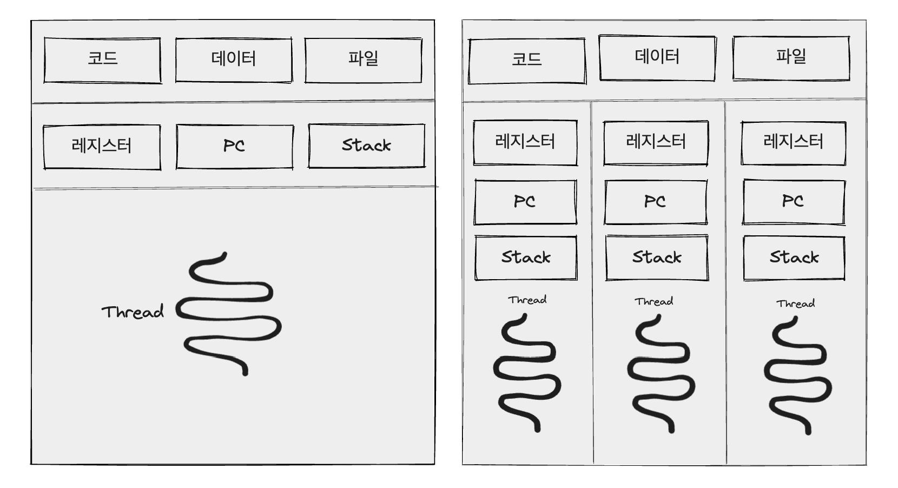
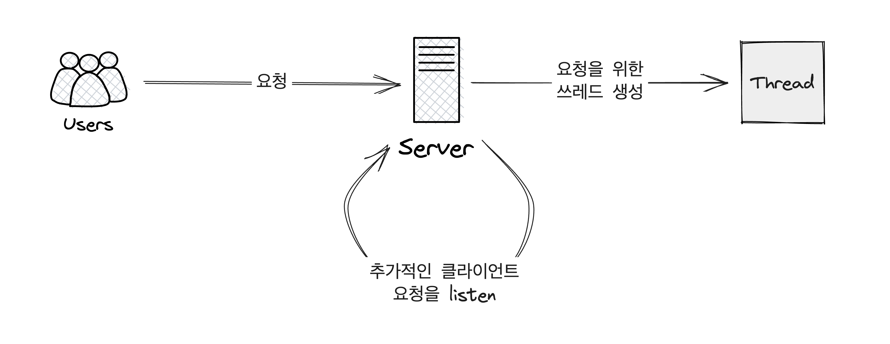
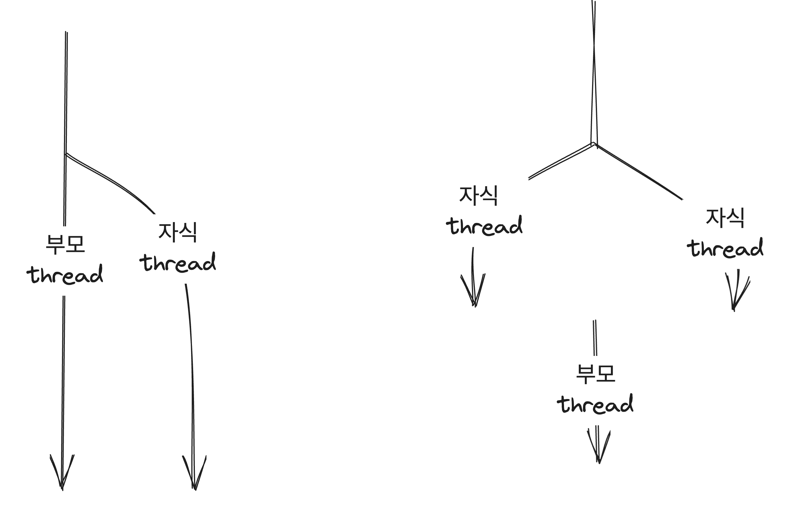

OS에서 Thread가 작동하는 방식을 알아보자

## 개요

스레드는 CPU 이용의 기본단위로 스레드 ID, 프로그램 카운터(PC), 레지스터 집합, 그리고 스택으로 구성되어있다. `스레드는 같은 프로세스에 속한 다른 스레드와 코드, 데이터 섹션, 그리고 열림 파일이나 신호와 같은 운영체제 자원들을 공유`한다.

전통적인 프로세스는 하나의 제어 스레드를 가지고 있지만, 프로세스가 다수의 제어 스레드를 가지게 된다면 프로세스는 동시에 하나 이상의 작업을 수행 할 수 있다. 아래 그림에서 단일 스레드와 멀티 스레드의 차이를 확인 할 수 있다.



- 단일 스레드 프로세스 & 다중 스레드 프로세스

단일 스레드 프로세스와 다르게 멀티 스레드 프로세스는 `프로세스가 가지는 코드, 데이터, 파일 영역을 스레드들이 공용`으로 사용하고, 레지스터, PC, Stack은 스레드 각각의 고유한 공간을 가지고 있다. 그림과 같이 하나의 응용 프로그램이 여러개의 실행 흐름을 가진 독립적인 프로세스로 구현되어 있을 때 이 실행 흐름을 스레드라고 한다.

이러한 멀티 스레드 프로세스를 활용하는 예시로 웹 서버가 있다. 웹 서버는 클라이언트로부터 웹 페이지나 이미지, 소리 등에 대한 요청을 받는다. 하나의 웹서버에 동시에 여러개의 클라이언트의 요청이 들어왔을때 전통적인 단일 스레드 프로세스는 단일 프로세스로 한번에 하나의 클라이언트만 서비스할 수 있게 된다.

이에 대한 해결책으로 스레드가 대중화되기 이전에는 하나의 클라이언트에 서비스를 하고 있을 때 별도의 요청이 들어왔을 때 그 요청을 수행할 별도의 프로세스를 생성하는 것이다. 이방식은 프로세스를 생성할 때 많은 시간과 자원을 소비하게 된다. 이러한 오버헤드(처리를 하기위해 들어가는 처리 시간, 메모리등)를 줄이기 위해 사용하기 시작한 것이 멀티 스레드 프로세스이다.

굳이 동일한 동작을 처리하는데 프로세스를 생성하는 것보다 프로세스 안에 여러 스레드를 만들어 처리하는 것이 효율적이다. 아래는 멀티 스레드를 적용한 웹서버이다.



이전과 같이 여러개의 요청이 들어왔을 때 각각의 요청을 위한 스레드를 생성하고 추가적인 클라이언트의 요청을 listen하는 작업을 서버에서는 계속하면서 요청이 들어오면 쓰레드를 늘리는 방식으로 동작하게 된다.

## 장점

- 응답성

  응용 프로그램을 멀티 스레드화 하면 응용 프로그램의 일부가 봉쇄되거나, 응용 프로그램이 긴 작업을 수행하더라도 프로그램의 수행이 계속되도록 해서 사용자에 대한 응답성을 증가시킨다. 특히 비동기적 스레드를 사용한다면, 오래 걸리는 연산을 비동기 스레드에서 실행시키면서 사용자에게 응답을 할 수 있다.

- 자원 공유

  스레드는 구조적으로 프로세스의 자원들과 메모리를 공유한다. 코드와 데이터 공유의 이점은 한 응용 프로그램이 같은 주소 공간내에 여러 개의 다른 작업을 하는 스레드를 가질 수 있다.

- 경제성

  자원 공유의 특성 덕분에 여러개의 프로세스를 생성하는 것보다 스레드를 증가 시키는게 오버헤드를 줄일 수 있다. 그로 인해 훨씬 더 경제적으로 설계할 수 있다.

- 규모 적응성

  다중 처리기 구조에서 멀티 스레드의 이점이 극대화 될 수 있다. 다중 처리기 구조에서도 각각의 처리기에 스레드가 병렬로 증가시키면서 수행 가능하기 때문이다.

## Threads Library

threads library는 프로그래머에게 스레드를 생성하고 관리하기 위한 API를 제공한다.

### 종류

- Pthreads
  POSIX thread 표준안의 스레드의 확장판으로 사용자 또는 커널 수준의 라이브러리로서 제공될 수 있다.
- Windows Threads
  Windows 시스템에서 사용가능한 커널 수준의 라이브러리이다.
- Java Thread API
  java 프로그램에서 직접 스레드 생성과 관리를 가능하게 한다. JVM의 thread 구현은 호스트 운영체제에서 실행되기 때문에 Windows의 경우 Windows Threads, Unix, Linux와 macOS 시스템에서는 통상 Pthreads를 사용한다.

### 비동기 스레딩 vs 동기 스레딩



- 비동기 스레딩

  비동기 스레딩은 부모가 자식 스레드를 생성한 후 부모는 자신의 실행을 재개하여 부모와 자식 스레드가 서로 독립적으로 병행하게 실행된다.
  부모 스레드와 자식 스레드가 독립적이므로 스레드 사이의 데이터 공유는 거의 없다.
  ex) 반응형 인터페이스 설계

- 동기 스레딩

  부모 스레드가 하나 이상의 자식 스레드를 생성하고 자식 스레드 모두가 종료할 때까지 기다렸다가 자신의 실행을 재개하는 방식을 말한다.
  부모 쓰레드는 모든 자식 스레드가 조인한 후에야 실행을 재개할 수 있다.
  통상 동기 스레딩은 스레드 상이의 상당한 양의 데이터 공유를 수반한다.
  ex) 부모스레드가 자식 스레드들이 계산한 결과를 통합하는 설계비

### Pthreads

- 예제 코드

```c
#include <pthread.h>
#include <stdio.h>
#include <stdlib.h>

int sum;
void *runner(void *param);

int main(int args, char *argv[]){
	// pthread 식별자, 스레스 속성 생성
  pthread_t tid[10];
  pthread_attr_t attr[10];

  for(int i = 0; i < 10; i++){
	// pthread 속성 지정
  pthread_attr_init(&attr[i]);
	// 쓰레드 생성 (식별자, 속성, 실행할 함수, param으로 전달할 정수);
  pthread_create(&tid[i], &attr[i], runner, argv[i]);
	// thread가 종료될 때까지 부모 스레드를 기다리게 함
  pthread_join(tid[i], NULL);
  }
  printf("sum = %d\n", sum);
}

// Thread가 실행할 함수
void *runner(void *param){
  int i, upper = atoi(param);
	printf("start = %d\n", upper);
  for(int i = 1; i <= upper; i++)
    sum += i;
	printf("end = %d\n", upper);
	// 자식 thread 종료
  pthread_exit(0);
}
```

- pthread_t

```c
  pthread_t tid[10];
```

pthread_t 문장은 우리가 생성할 스레드를 위한 식별자를 선언한다. 각 스레드는 스택의 크기와 스케줄링 정보를 포함한 속성의 집합을 갖는다.

- pthread_attr_t

```c
  pthread_attr_t attr[10];
  // pthread 속성 지정
  pthread_attr_inti(&attr[i]);
```

pthread_attr_t 선언은 스레드를 위한 속성을 나타낸다. 예제에서는 다로 속성을 지정해주지 않았기 때문에 기본 속성을 사용한다.

- create

```c
  // 쓰레드 생성 (식별자, 속성, 실행할 함수, param으로 전달할 정수);
  pthread_create(&tid[i], &attr[i], runner, argv[i]);
```

- join

```c
  // thread가 종료될 때까지 부모 스레드를 기다리게 함
  pthread_join(tid[i], NULL);
```

- exit

```c
  	// 자식 thread 종료
    pthread_exit(0);
```

- 결과

동기 처리한 결과

```bash
  ❯ ./test 1 2 3 4 5 7 18 2 2 2
  start = 1
  end = 1
  start = 2
  end = 2
  start = 3
  end = 3
  start = 4
  end = 4
  start = 5
  end = 5
  start = 7
  end = 7
  start = 18
  end = 18
  start = 2
  end = 2
  start = 2
  end = 2
  start = 2
  end = 2
  sum = 243
```

비동기 처리한 결과

```bash
❯ ./test 1 2 3 4 5 7 18 2 2 2
start = 1
end = 1
start = 2
end = 2
start = 3
end = 3
start = 2
end = 2
start = 5
end = 5
start = 18
end = 18
start = 7
start = 4
end = 4
sum = 13
end = 7
```

부모 스레드가 자식 스레드를 기다리지 못하고 종료되므로 결과값이 출력되지 않는다.

### Windows Threads

- 예제코드

```c
#include <windows.h>
#include <stdio.h>
DWORD Sum;
// thread가 실행할 함수
DWORD WINAPI Summation(LPVOID Param){
	DWORD Upper = *(DWORD*)Param;
	for (DWORD i = 1; i <= Upper; i++)
		Sum += i;
	return 0;
}
int main(int argc, char *argv[]){
  DWORD ThreadId;
  HANDLE ThreadHandle;
  int Param;
  Param = atoi(argv[1]);
	// thread 생성
  ThreadHandle = CreateThread(
  NULL, // default 보안 정보
  0, // default stack size
  Summation, // thread에서 실행할 함수
  &Param, // thread에 넘겨줄 param
  0, // 쓰레드가 일시정지상태로 시작할지 아닐지를 확인하는 flag
  &ThreadId); // 리턴할 Threadidentifier

  // thread가 종료될 때까지 기다린다. Pthread의 join과 비슷한 역할
  WaitForSingleObject(ThreadHandle,INFINITE);
	// thread를 종료시킨다.
  CloseHandle(ThreadHandle);
  printf("sum = %d∖n",Sum);
}
```

- CreateThread

```c
  ThreadHandle = CreateThread(
    NULL, // default 보안 정보
    0, // default stack size
    Summation, // thread에서 실행할 함수
    &Param, // thread에 넘겨줄 param
    0, // 쓰레드가 일시정지상태로 시작할지 아닐지를 확인하는 flag
    &ThreadId); // 리턴할 Threadidentifier
```

thread 생성시 thread의 속성을 설정 할 수 있는데 Windows threads의 경우 순서대로 보안 정보, stack 사이즈, thread에서 실행할 함수, 함수에게 넘겨줄 param, 쓰레드가 일시정지 상태로 시작할지 곧바로 CPU스케줄러에 바로 실행시킬지, 마지막으로 리턴할 thread identifier을 넣어서 속성을 설정한다.

- waifForSingleObject

```c
    // thread가 종료될 때까지 기다린다. Pthread의 join과 비슷한 역할
    WaitForSingleObject(ThreadHandle,INFINITE);
```

Pthread와 마찬가지로 join과 같이 동기 thread를 구현하기 위해 WaitForSingleObject를 사용한다. WaitForSingleObject 함수에 필요한 Param들은 아래와 같다.

```c
WaitForMultipleObjects(N, THandles, TRUE, INFINITE);
```

1. **대기할 객체의 수**: 함수가 기다려야 할 객체의 총 개수
2. **객체 배열에 대한 포인터**: 대기할 객체들의 배열을 가리키는 포인터
3. **모든 객체가 신호를 받았는지 나타내는 플래그**: 모든 객체가 신호를 받았는지 여부를 나타내는 부울 값입니다. **`TRUE`**는 모든 객체가 신호를 받을 때까지 기다린다는 것을 의미
4. **타임아웃 기간 (또는 `INFINITE`)**: 함수가 기다릴 최대 시간을 지정(**`INFINITE`**는 무한 대기를 의미합니다.)

- CloseHandle

```c
  	// thread를 종료시킨다.
    CloseHandle(ThreadHandle);
```

### Java Thread

- 예제 코드

```java
package assets.code.thread;

import java.util.concurrent.Callable;
import java.util.concurrent.ExecutionException;
import java.util.concurrent.ExecutorService;
import java.util.concurrent.Executors;
import java.util.concurrent.Future;

// Callable interface implemnts call method를 포함하고 있어야 한다.
class Summation implements Callable<Integer> {
  private int upper;

  public Summation(int upper) {
    this.upper = upper;
  }

	// call
  public Integer call() {
    int sum = 0;
    for (int i = 1; i <= upper; i++)
      sum += i;
    return sum;
  }
}

public class Driver {
  public static void main(String[] args) {
    int upper = Integer.parseInt(args[0]);

		// Executor library를 사욯해 Single Thread 생성
    ExecutorService pool = Executors.newSingleThreadExecutor();
		// Executor 인터페이스의 결과를 반환할때 Future Object
    Future<Integer> result = pool.submit(new Summation(upper));

		// result.get() error 처리
    try {
      System.out.println("sum = " + result.get());
    } catch (InterruptedException | ExecutionException ie) {
    }
    return;
  }
}
```

- Executor

```java
  // Executor library를 사욯해 Single Thread 생성
  ExecutorService pool = Executors.newSingleThreadExecutor();
  // Executor 인터페이스의 결과를 반환할때 Future Object
  Future<Integer> result = pool.submit(new Summation(upper));
```

자바에서는 Executor 프레임 워크를 통해 스레드 생성과 관리에 대한 기능을 제공한다. Executor는 java.util.concurrent 패키지에 있다. Executor 인터페이스에서 결과를 반환할때는 Future객체로 반환하기 때문에 결과를 받기 위해서는 Future 객체로 생성한다.

- Summation

```java
  class Summation implements Callable<Integer> {
    private int upper;

    public Summation(int upper) {
      this.upper = upper;
    }

  	// call
    public Integer call() {
      int sum = 0;
      for (int i = 1; i <= upper; i++)
        sum += i;
      return sum;
    }
  }
```

Summation은 Callable 인터페이스를 구현한 것으로 call method를 가지고 있다. call method에 스레드에서 실행하고 싶은 메서드를 구현한다.

- Exception

```java
  try {
  	System.out.println("sum = " + result.get());
  } catch (InterruptedException | ExecutionException ie) {}
```

result.get()에서 생길 수 잇는 InterruptedException과 ExecutionException을 예외처리 해준다.

- 결과

```bash
  ❯ java assets.code.thread.Driver 10
  sum = 55
```

### 참고자료

https://simple-ing.tistory.com/67

운영체제[제10판] 제 4장 Thread & Concurrncy - Abraham Silberschatz,Peter Baer Galvin,Greg Gagne 저 퍼스트북

[null null한 개발자 - process와 쓰레드](https://www.youtube.com/watch?v=x-Lp-h_pf9Q)
